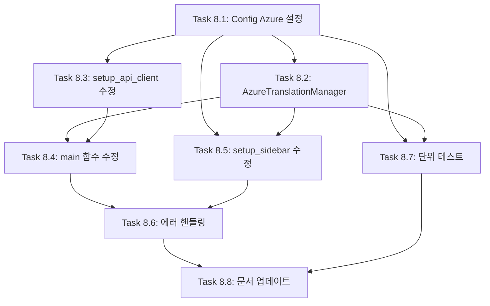

# FEATURE-008: Azure OpenAI Service 지원

## 개요

- **기능명**: Azure OpenAI Service 지원
- **상태**: 🔲 예정
- **분류**: 백엔드 + 프론트엔드
- **우선순위**: P1
- **진행률**: 0%
- **예상 시간**: 8시간
- **시작일**: TBD
- **완료일**: TBD

## 기능 설명

사용자가 OpenAI와 Azure OpenAI Service 중 선택하여 번역 서비스를 이용할 수 있도록 지원합니다. Config 클래스를 통해 Provider 설정을 관리하고, TranslationManager 상속 구조로 각 Provider별 번역 로직을 캡슐화합니다.

## 배경 및 필요성

### 현재 문제점

- OpenAI API만 지원하여 Azure OpenAI Service 사용자 지원 불가
- 기업 환경에서 Azure OpenAI Service 사용 시 별도 코드 수정 필요
- Provider 전환 시 코드 변경 필요

### 개선 효과

- 기업 환경(Azure) 사용자 지원
- OpenAI와 Azure 간 유연한 전환 가능
- 하위 호환성 유지 (기존 OpenAI 사용자 영향 없음)
- Config 클래스 통합으로 설정 관리 일원화
- TranslationManager 상속 구조로 확장성 향상

## 요구사항

### 기능 요구사항 (Functional Requirements)

#### FR-1: Provider 선택 및 설정 관리

- Config 클래스에서 Provider 설정 관리
- 환경 변수(.env)에서 Provider 선택
- OpenAI와 Azure OpenAI 간 전환 가능

#### FR-2: Azure OpenAI 필수 파라미터 지원

- API Key
- Endpoint (리소스 URL)
- API Version
- Deployment 이름 (모델별)

#### FR-3: TranslationManager 상속 구조

- OpenAI용 TranslationManager (기존)
- Azure용 AzureTranslationManager (신규)
- Factory 패턴으로 Provider별 인스턴스 생성

#### FR-4: UI에서 Provider 정보 표시

- 현재 사용 중인 Provider 표시
- Azure 선택 시 Deployment 정보 표시
- Provider별 모델/Deployment 목록 분리

### 비기능 요구사항 (Non-Functional Requirements)

#### NFR-1: 하위 호환성

- 기존 OpenAI 사용자 경험 유지
- 환경 변수 미설정 시 기본값(OpenAI) 사용
- 코드 변경 없이 Provider 전환 가능

#### NFR-2: 설정 일관성

- Config 클래스로 모든 설정 관리
- .env 파일 하나로 모든 Provider 설정 관리
- 타입 안전성 및 검증 로직 통합

#### NFR-3: 명확한 에러 메시지

- Provider 설정 오류 시 상세한 안내
- 필수 파라미터 누락 시 구체적 안내
- API 호출 실패 시 Provider별 에러 처리

## 아키텍처 설계

### Config 클래스 확장

```python
# config.py

class Config:
    """애플리케이션 설정 관리 클래스"""

    # 기존 OpenAI 설정 (유지)
    OPENAI_API_KEY: Optional[str] = None
    OPENAI_API_TIMEOUT: int = 60
    OPENAI_MAX_RETRIES: int = 3
    DEFAULT_MODEL: str = "gpt-4o-mini"
    DEFAULT_TEMPERATURE: float = 0.3
    MAX_TOKENS: int = 4000

    # Azure OpenAI 설정 (신규)
    AI_PROVIDER: str = "openai"  # "openai" or "azure"
    AZURE_OPENAI_API_KEY: Optional[str] = None
    AZURE_OPENAI_ENDPOINT: Optional[str] = None
    AZURE_OPENAI_API_VERSION: str = "2024-02-15-preview"
    AZURE_DEPLOYMENTS: Optional[str] = None  # "model:deployment,model:deployment"

    @classmethod
    def load(cls) -> 'Config':
        """환경 변수에서 설정 로드"""
        config = cls()

        # Provider 설정
        config.AI_PROVIDER = cls._get_str_env("AI_PROVIDER", cls._DEFAULT_AI_PROVIDER)
        cls._validate_provider(config.AI_PROVIDER)

        # Azure 설정
        config.AZURE_OPENAI_API_KEY = os.getenv("AZURE_OPENAI_API_KEY")
        config.AZURE_OPENAI_ENDPOINT = os.getenv("AZURE_OPENAI_ENDPOINT")
        config.AZURE_OPENAI_API_VERSION = cls._get_str_env(
            "AZURE_OPENAI_API_VERSION",
            cls._DEFAULT_AZURE_API_VERSION
        )
        config.AZURE_DEPLOYMENTS = os.getenv("AZURE_DEPLOYMENTS")

        return config

    @staticmethod
    def _validate_provider(provider: str) -> None:
        """Provider 유효성 검증"""
        if provider not in ["openai", "azure"]:
            raise ValueError(f"지원하지 않는 Provider입니다: {provider}")

    @staticmethod
    def parse_azure_deployments(deployments_str: Optional[str]) -> dict[str, str]:
        """Azure deployment 문자열 파싱

        Args:
            deployments_str: "gpt-4o:my-gpt4o,gpt-4o-mini:my-mini" 형식

        Returns:
            {"GPT-4o": "my-gpt4o", "GPT-4o Mini": "my-mini"}
        """
        if not deployments_str:
            return {}

        result = {}
        for pair in deployments_str.split(","):
            if ":" in pair:
                model, deployment = pair.split(":", 1)
                # 모델명을 UI 표시용으로 변환
                display_name = model.strip().replace("-", " ").title()
                result[display_name] = deployment.strip()

        return result
```

### TranslationManager 상속 구조

```python
# components/translation.py

from typing import Optional
from config import Config


class TranslationManager:
    """OpenAI 번역 관리 클래스"""

    SUPPORTED_MODELS = [
        "gpt-4o",
        "gpt-4o-mini",
        "gpt-4-turbo",
        "gpt-4",
        "gpt-3.5-turbo"
    ]

    def __init__(
        self,
        client,
        model: Optional[str] = None,
        temperature: Optional[float] = None,
        timeout: Optional[int] = None,
        max_retries: Optional[int] = None,
        max_tokens: Optional[int] = None
    ):
        """기존 OpenAI TranslationManager (변경 없음)"""
        config = Config.load()

        self.model = model if model is not None else config.DEFAULT_MODEL
        self.temperature = temperature if temperature is not None else config.DEFAULT_TEMPERATURE
        self.timeout = timeout if timeout is not None else config.OPENAI_API_TIMEOUT
        self.max_retries = max_retries if max_retries is not None else config.OPENAI_MAX_RETRIES
        self.max_tokens = max_tokens if max_tokens is not None else config.MAX_TOKENS

        if not self.validate_model(self.model):
            raise ValueError(f"지원하지 않는 모델입니다: {self.model}")

        self.client = client

    def translate(self, text: str, source: str, target: str) -> str:
        """텍스트 번역 (기존 로직 유지)"""
        response = self.client.chat.completions.create(
            model=self.model,  # OpenAI는 모델명 사용
            messages=[...],
            temperature=self.temperature,
            max_tokens=self.max_tokens,
            timeout=self.timeout
        )
        return response.choices[0].message.content

    # ... 기존 메서드 유지


class AzureTranslationManager(TranslationManager):
    """Azure OpenAI 번역 관리 클래스"""

    # Azure deployment 목록 (설정에서 로드)
    SUPPORTED_DEPLOYMENTS: dict[str, str] = {}

    def __init__(
        self,
        client,
        deployment: str,
        model: Optional[str] = None,
        temperature: Optional[float] = None,
        timeout: Optional[int] = None,
        max_retries: Optional[int] = None,
        max_tokens: Optional[int] = None
    ):
        """Azure OpenAI용 초기화

        Args:
            client: AzureOpenAI 클라이언트 인스턴스
            deployment: Azure deployment 이름
            model: 원래 모델명 (표시용)
            ...
        """
        # 부모 클래스 초기화 (검증 우회)
        config = Config.load()

        self.deployment = deployment
        self.model = model if model is not None else deployment
        self.temperature = temperature if temperature is not None else config.DEFAULT_TEMPERATURE
        self.timeout = timeout if timeout is not None else config.OPENAI_API_TIMEOUT
        self.max_retries = max_retries if max_retries is not None else config.OPENAI_MAX_RETRIES
        self.max_tokens = max_tokens if max_tokens is not None else config.MAX_TOKENS

        self.client = client

    def translate(self, text: str, source: str, target: str) -> str:
        """텍스트 번역 (Azure 전용)

        OpenAI와 다른 점: model 대신 deployment 사용
        """
        response = self.client.chat.completions.create(
            model=self.deployment,  # Azure는 deployment 이름 사용
            messages=[
                {
                    "role": "system",
                    "content": f"You are a professional translator. Translate the following {source} text to {target}. IMPORTANT: Preserve all Markdown formatting (bold, italic, headings, lists, links, code blocks, blockquotes, tables, etc.) in the translation. Only respond with the translation, nothing else."
                },
                {
                    "role": "user",
                    "content": text
                }
            ],
            temperature=self.temperature,
            max_tokens=self.max_tokens,
            timeout=self.timeout
        )
        return response.choices[0].message.content

    @classmethod
    def load_deployments(cls, config: Config) -> None:
        """Config에서 deployment 목록 로드"""
        cls.SUPPORTED_DEPLOYMENTS = config.parse_azure_deployments(
            config.AZURE_DEPLOYMENTS
        )

    @staticmethod
    def validate_deployment(deployment: str) -> bool:
        """Deployment 유효성 검증"""
        return deployment in AzureTranslationManager.SUPPORTED_DEPLOYMENTS.values()


class TranslationManagerFactory:
    """번역 관리자 생성 팩토리"""

    @staticmethod
    def create(provider: str, client, **kwargs) -> TranslationManager:
        """Provider에 따른 TranslationManager 생성

        Args:
            provider: "openai" or "azure"
            client: OpenAI 또는 AzureOpenAI 클라이언트
            **kwargs: TranslationManager 초기화 파라미터

        Returns:
            TranslationManager 또는 AzureTranslationManager 인스턴스
        """
        if provider == "azure":
            return AzureTranslationManager(client, **kwargs)
        return TranslationManager(client, **kwargs)
```

### app.py 수정 (setup_api_client)

```python
# app.py

def setup_api_client() -> tuple:
    """OpenAI/Azure API 클라이언트 설정

    Returns:
        (client, provider) 튜플
    """
    config = Config.load()
    provider = config.AI_PROVIDER

    if provider == "azure":
        # Azure OpenAI 클라이언트 생성
        if not config.AZURE_OPENAI_API_KEY:
            st.error("⚠️ AZURE_OPENAI_API_KEY가 설정되지 않았습니다.")
            st.stop()
        if not config.AZURE_OPENAI_ENDPOINT:
            st.error("⚠️ AZURE_OPENAI_ENDPOINT가 설정되지 않았습니다.")
            st.stop()

        from openai import AzureOpenAI

        client = AzureOpenAI(
            api_key=config.AZURE_OPENAI_API_KEY,
            azure_endpoint=config.AZURE_OPENAI_ENDPOINT,
            api_version=config.AZURE_OPENAI_API_VERSION,
            timeout=config.OPENAI_API_TIMEOUT,
            max_retries=config.OPENAI_MAX_RETRIES
        )

        # Azure deployment 목록 로드
        AzureTranslationManager.load_deployments(config)

        return client, "azure"

    else:
        # OpenAI 클라이언트 생성 (기존)
        if not config.OPENAI_API_KEY:
            st.warning("⚠️ OpenAI API 키를 입력해주세요.")
            api_key = st.sidebar.text_input(
                "OpenAI API 키",
                type="password",
                help="https://platform.openai.com/api-keys"
            )
            if not api_key:
                st.stop()
        else:
            api_key = config.OPENAI_API_KEY

        from openai import OpenAI

        client = OpenAI(
            api_key=api_key,
            timeout=config.OPENAI_API_TIMEOUT,
            max_retries=config.OPENAI_MAX_RETRIES
        )

        return client, "openai"
```

## 작업(Task) 분해

### Task 8.1: Config 클래스 Azure 설정 추가 (백엔드)

**설명**: config.py에 Azure OpenAI 관련 설정 추가

**세부 작업**:

1. Azure 설정 변수 추가
   - `AI_PROVIDER`, `AZURE_OPENAI_API_KEY`, `AZURE_OPENAI_ENDPOINT`
   - `AZURE_OPENAI_API_VERSION`, `AZURE_DEPLOYMENTS`
2. `load()` 메서드에 Azure 설정 로딩 로직 추가
3. `_validate_provider()` 메서드 추가
4. `parse_azure_deployments()` 메서드 추가
5. `.env.example` 업데이트

**예상 시간**: 1시간

**의존성**: 없음

**테스트 범위**:

- Config.load()에서 Azure 설정 로드 확인
- Provider 검증 테스트
- Deployment 파싱 테스트

**완료 조건**:

- config.py에 Azure 설정 추가 완료
- .env.example 업데이트 완료
- test_config.py에 Azure 관련 테스트 추가 및 통과

---

### Task 8.2: AzureTranslationManager 클래스 구현 (백엔드)

**설명**: components/translation.py에 Azure 전용 TranslationManager 클래스 추가

**세부 작업**:

1. `AzureTranslationManager` 클래스 작성 (TranslationManager 상속)
2. `__init__()`: deployment 파라미터 추가
3. `translate()` 메서드 오버라이드 (deployment 사용)
4. `load_deployments()` 클래스 메서드 추가
5. `TranslationManagerFactory` 클래스 추가

**예상 시간**: 1.5시간

**의존성**: Task 8.1

**테스트 범위**:

- AzureTranslationManager 초기화 테스트
- deployment 사용 번역 테스트 (Mock)
- Factory 패턴 테스트

**완료 조건**:

- AzureTranslationManager 클래스 구현 완료
- TranslationManagerFactory 구현 완료
- test_translation.py에 Azure 관련 테스트 추가 및 통과

---

### Task 8.3: setup_api_client() 함수 수정 (백엔드)

**설명**: app.py의 setup_api_client() 함수를 Provider별 클라이언트 생성으로 수정

**세부 작업**:

1. Config에서 AI_PROVIDER 로드
2. Provider가 "azure"일 경우:
   - AzureOpenAI 클라이언트 생성
   - 필수 파라미터 검증
   - AzureTranslationManager.load_deployments() 호출
3. Provider가 "openai"일 경우:
   - 기존 OpenAI 클라이언트 생성 로직 유지
4. (client, provider) 튜플 반환

**예상 시간**: 1시간

**의존성**: Task 8.1, 8.2

**테스트 범위**:

- OpenAI 클라이언트 생성 확인
- Azure 클라이언트 생성 확인
- 필수 파라미터 누락 시 에러 메시지 확인

**완료 조건**:

- setup_api_client() 함수 수정 완료
- Provider별 클라이언트 생성 확인
- 에러 처리 완료

---

### Task 8.4: main() 함수 TranslationManager 생성 수정 (백엔드 + 프론트엔드)

**설명**: main() 함수에서 Factory 패턴으로 TranslationManager 생성

**세부 작업**:

1. `setup_api_client()`에서 (client, provider) 튜플 받기
2. TranslationManagerFactory.create() 사용
3. Azure일 경우 deployment 파라미터 전달
4. OpenAI일 경우 model 파라미터 전달 (기존)

**예상 시간**: 30분

**의존성**: Task 8.2, 8.3

**테스트 범위**:

- OpenAI TranslationManager 생성 확인
- Azure TranslationManager 생성 확인

**완료 조건**:

- main() 함수 수정 완료
- Factory 패턴 적용 확인

---

### Task 8.5: setup_sidebar() 함수 모델/Deployment 목록 분리 (프론트엔드)

**설명**: 사이드바에서 Provider에 따라 모델/Deployment 목록 표시

**세부 작업**:

1. Provider 정보 표시 (OpenAI / Azure)
2. OpenAI일 경우: 기존 모델 목록 표시
3. Azure일 경우: Deployment 목록 표시
4. Deployment 미설정 시 경고 메시지
5. 선택한 모델/Deployment 반환

**예상 시간**: 1시간

**의존성**: Task 8.1, 8.2

**테스트 범위**:

- OpenAI 모델 목록 표시 확인
- Azure Deployment 목록 표시 확인
- 빈 Deployment 경고 확인

**완료 조건**:

- setup_sidebar() 함수 수정 완료
- Provider별 UI 분기 완료
- 사용자 피드백 제공

---

### Task 8.6: 에러 핸들링 및 검증 (백엔드 + 프론트엔드)

**설명**: Azure 관련 에러 처리 및 검증 로직 추가

**세부 작업**:

1. config.py: Provider, Azure 파라미터 검증
2. app.py: Azure 필수 파라미터 누락 시 에러 메시지
3. translation.py: API 호출 실패 시 Provider별 에러 처리
4. 사용자 친화적 에러 메시지 작성

**예상 시간**: 30분

**의존성**: Task 8.1 ~ 8.5

**테스트 범위**:

- 필수 파라미터 누락 테스트
- Provider 오류 테스트
- API 호출 실패 테스트

**완료 조건**:

- 모든 에러 케이스 처리 완료
- 명확한 에러 메시지 제공

---

### Task 8.7: 단위 테스트 작성 (테스트)

**설명**: Config 및 TranslationManager Azure 관련 단위 테스트 작성

**세부 작업**:

1. **test_config.py** (Azure 설정 테스트, 10개)
   - Config.load() Azure 설정 로드 테스트
   - _validate_provider() 테스트
   - parse_azure_deployments() 테스트
2. **test_translation.py** (AzureTranslationManager 테스트, 12개)
   - AzureTranslationManager 초기화 테스트
   - translate() 메서드 테스트 (Mock)
   - load_deployments() 테스트
   - TranslationManagerFactory 테스트
3. 커버리지 80% 이상 유지

**예상 시간**: 2시간

**의존성**: Task 8.1 ~ 8.6

**테스트 범위**:

- Config Azure 설정 테스트
- AzureTranslationManager 단위 테스트
- Factory 패턴 테스트

**완료 조건**:

- 모든 단위 테스트 통과
- 커버리지 80% 이상
- pytest HTML 리포트 생성

---

### Task 8.8: 문서 업데이트 (문서화)

**설명**: README, PRD, CLAUDE 문서에 Azure 지원 내용 추가

**세부 작업**:

1. **README.md**
   - Azure OpenAI 설정 가이드 추가
   - .env 파일 설정 예시 추가
   - Azure Deployment 설정 방법 설명
2. **PRD.md**
   - 완료된 기능에 FEATURE-008 표시
   - 기술 스택에 Azure OpenAI 추가
3. **CLAUDE.md**
   - Azure OpenAI 개발 가이드 추가
   - TranslationManager 상속 구조 설명
   - Config 클래스 Azure 설정 가이드
4. **.env.example**
   - Azure 관련 변수 추가 및 주석 설명

**예상 시간**: 1.5시간

**의존성**: Task 8.1 ~ 8.7

**테스트 범위**:

- Markdownlint 규칙 준수
- 링크 유효성 확인
- 정보 정확도 검증

**완료 조건**:

- 모든 문서 업데이트 완료
- Markdownlint 통과
- Azure 설정 가이드 명확

---

## 작업 순서 및 의존성



### 병렬 작업 가능

- Task 8.2, 8.3은 Task 8.1 완료 후 병렬 진행 가능
- Task 8.4, 8.5는 Task 8.2, 8.3 완료 후 병렬 진행 가능

## 기술 분석

### OpenAI vs Azure OpenAI 차이점

| 항목 | OpenAI | Azure OpenAI |
| ---- | ------ | ------------ |
| 클라이언트 클래스 | `OpenAI` | `AzureOpenAI` |
| 필수 파라미터 | `api_key` | `api_key`, `azure_endpoint`, `api_version` |
| 모델 지정 | 모델명 (예: gpt-4o) | Deployment 이름 (사용자 정의) |
| 엔드포인트 | 고정 (api.openai.com) | 사용자 리소스 URL |
| Config 관리 | OPENAI_API_KEY | AZURE_OPENAI_API_KEY, AZURE_OPENAI_ENDPOINT, etc. |

### 아키텍처 비교

#### 변경 전 (함수 기반)

```text
app.py
├── OpenAI 클라이언트 생성 (하드코딩)
└── TranslationManager (OpenAI만 지원)
```

#### 변경 후 (클래스 기반 + 상속)

```text
config.py
├── Config 클래스
│   ├── OpenAI 설정
│   └── Azure 설정

components/translation.py
├── TranslationManager (OpenAI)
├── AzureTranslationManager (Azure, 상속)
└── TranslationManagerFactory (Factory 패턴)

app.py
├── setup_api_client() → (client, provider)
└── TranslationManagerFactory.create()
```

### .env 파일 예시

```bash
# Provider 선택 (openai 또는 azure)
AI_PROVIDER=azure

# OpenAI 설정
OPENAI_API_KEY=sk-...

# Azure OpenAI 설정
AZURE_OPENAI_API_KEY=your-azure-api-key
AZURE_OPENAI_ENDPOINT=https://your-resource.openai.azure.com/
AZURE_OPENAI_API_VERSION=2024-02-15-preview
AZURE_DEPLOYMENTS=gpt-4o:my-gpt4o-deployment,gpt-4o-mini:my-mini-deployment
```

## 진행 현황

### Task별 완료 상태

| Task | 제목 | 상태 | 예상 시간 | 실제 시간 | 완료일 | 커밋 | 이슈 |
| ---- | ---- | ---- | --------- | --------- | ------ | ---- | ---- |
| 8.1 | Config Azure 설정 추가 | ✅ 완료 | 1h | 1h | 2026-01-31 | 0236e80 | #10 |
| 8.2 | AzureTranslationManager 구현 | ✅ 완료 | 1.5h | 1.5h | 2026-01-31 | 1261312 | #11 |
| 8.3 | setup_api_client 수정 | ✅ 완료 | 1h | 50m | 2026-01-31 | d48205a | #12 |
| 8.4 | main 함수 수정 | ✅ 완료 | 30m | 10m | 2026-01-31 | d48205a | #12 |
| 8.5 | setup_sidebar 수정 | ✅ 완료 | 1h | 1h 9m | 2026-01-31 | - | #14 |
| 8.6 | 에러 핸들링 | 🔲 예정 | 30m | - | - | - | - |
| 8.7 | 단위 테스트 작성 | 🔲 예정 | 2h | - | - | - | - |
| 8.8 | 문서 업데이트 | 🔲 예정 | 1.5h | - | - | - | - |

### 전체 진행률

- **예상 총 시간**: 9시간
- **실제 소요 시간**: 4시간 39분
- **진행률**: 63% (5/8 완료)

### 주요 마일스톤

- ✅ **Phase 1 완료**: 백엔드 인프라 (Task 8.1~8.3)
- ✅ **Phase 2 완료**: UI 통합 (Task 8.4~8.5)
- 🔲 **Phase 3 완료**: 품질 검증 (Task 8.6~8.8)

## 완료 기준

### 기능 완료

- [ ] Config 클래스에 Azure 설정 추가 완료
- [ ] AzureTranslationManager 클래스 구현 완료
- [ ] TranslationManagerFactory 구현 완료
- [ ] OpenAI Provider로 정상 번역 동작
- [ ] Azure Provider로 정상 번역 동작
- [ ] Provider 전환 시 .env만 수정으로 동작

### 품질 완료

- [ ] Azure 필수 파라미터 누락 시 명확한 에러 메시지
- [ ] 모든 단위 테스트 통과 (test_config.py, test_translation.py)
- [ ] 코드 커버리지 80% 이상 유지
- [ ] pytest HTML 리포트 생성

### 문서 완료

- [ ] README.md에 Azure 설정 가이드 추가
- [ ] CLAUDE.md에 Azure 개발 가이드 추가
- [ ] PRD.md에 FEATURE-008 완료 표시
- [ ] .env.example 업데이트 완료

## 테스트 계획

### 테스트 케이스

| ID | 테스트 시나리오 | 예상 결과 |
| -- | --------------- | --------- |
| TC-1 | AI_PROVIDER=openai 설정 | OpenAI 클라이언트 생성 성공 |
| TC-2 | AI_PROVIDER=azure + 모든 필수 변수 설정 | AzureOpenAI 클라이언트 생성 성공 |
| TC-3 | AI_PROVIDER=azure + 변수 누락 | 명확한 에러 메시지 표시 |
| TC-4 | OpenAI로 번역 실행 | 정상 번역 완료 |
| TC-5 | Azure로 번역 실행 | 정상 번역 완료 |
| TC-6 | Provider 전환 (OpenAI ↔ Azure) | .env만 수정으로 전환 성공 |
| TC-7 | Azure Deployment 미설정 | 경고 메시지 표시 |
| TC-8 | parse_azure_deployments() 정상 파싱 | 딕셔너리 반환 |

### 단위 테스트 예시

```python
# tests/test_config.py

class TestConfigAzure:
    """Config 클래스 Azure 설정 테스트"""

    def test_load_with_azure_provider(self, monkeypatch):
        """Azure Provider 설정 로드 테스트"""
        monkeypatch.setenv("AI_PROVIDER", "azure")
        monkeypatch.setenv("AZURE_OPENAI_API_KEY", "test-key")
        monkeypatch.setenv("AZURE_OPENAI_ENDPOINT", "https://test.openai.azure.com/")

        config = Config.load()

        assert config.AI_PROVIDER == "azure"
        assert config.AZURE_OPENAI_API_KEY == "test-key"
        assert config.AZURE_OPENAI_ENDPOINT == "https://test.openai.azure.com/"

    def test_validate_provider_invalid(self):
        """Provider 검증 실패 테스트"""
        with pytest.raises(ValueError, match="지원하지 않는 Provider"):
            Config._validate_provider("invalid")

    def test_parse_azure_deployments(self):
        """Azure deployment 파싱 테스트"""
        deployments_str = "gpt-4o:my-gpt4o,gpt-4o-mini:my-mini"
        result = Config.parse_azure_deployments(deployments_str)

        assert "Gpt 4O" in result or "GPT-4o" in result.values()
        assert "my-gpt4o" in result.values()


# tests/test_translation.py

class TestAzureTranslationManager:
    """AzureTranslationManager 클래스 테스트"""

    def test_init_with_deployment(self):
        """Azure deployment 초기화 테스트"""
        mock_client = Mock()
        manager = AzureTranslationManager(
            mock_client,
            deployment="my-gpt4o-deployment",
            model="gpt-4o"
        )

        assert manager.deployment == "my-gpt4o-deployment"
        assert manager.model == "gpt-4o"

    def test_translate_uses_deployment(self):
        """번역 시 deployment 사용 테스트"""
        mock_client = Mock()
        mock_response = Mock()
        mock_response.choices = [Mock()]
        mock_response.choices[0].message.content = "번역 결과"
        mock_client.chat.completions.create.return_value = mock_response

        manager = AzureTranslationManager(
            mock_client,
            deployment="my-deployment"
        )

        result = manager.translate("Hello", "English", "Korean")

        # deployment 이름으로 호출했는지 확인
        call_args = mock_client.chat.completions.create.call_args
        assert call_args[1]["model"] == "my-deployment"
        assert result == "번역 결과"


class TestTranslationManagerFactory:
    """TranslationManagerFactory 테스트"""

    def test_create_openai_manager(self):
        """OpenAI TranslationManager 생성 테스트"""
        mock_client = Mock()
        manager = TranslationManagerFactory.create(
            "openai",
            mock_client,
            model="gpt-4o"
        )

        assert isinstance(manager, TranslationManager)
        assert not isinstance(manager, AzureTranslationManager)

    def test_create_azure_manager(self):
        """Azure TranslationManager 생성 테스트"""
        mock_client = Mock()
        manager = TranslationManagerFactory.create(
            "azure",
            mock_client,
            deployment="my-deployment"
        )

        assert isinstance(manager, AzureTranslationManager)
        assert manager.deployment == "my-deployment"
```

## 리스크 및 대응 방안

### 리스크 1: 하위 호환성 깨짐

**가능성**: 중간

**영향**: 높음

**대응 방안**:

- 기존 OpenAI 사용자는 AI_PROVIDER 미설정 시 자동으로 "openai" 사용
- TranslationManager 클래스는 변경 없이 유지
- 기존 .env 파일도 그대로 사용 가능

### 리스크 2: Azure API 버전 변경

**가능성**: 중간

**영향**: 중간

**대응 방안**:

- api_version을 Config 클래스로 관리
- 기본값 제공하되 환경 변수로 오버라이드 가능
- 문서에 최신 API 버전 안내

### 리스크 3: Deployment 이름 오타

**가능성**: 높음

**영향**: 중간

**대응 방안**:

- AZURE_DEPLOYMENTS 파싱 시 검증 로직 추가
- 명확한 에러 메시지 제공
- 문서에 설정 예시 상세 작성

### 리스크 4: 테스트 커버리지 감소

**가능성**: 낮음

**영향**: 높음

**대응 방안**:

- Azure 관련 단위 테스트 철저히 작성
- Mock 객체로 API 호출 테스트
- 커버리지 80% 이상 필수

## 참고 자료

### Azure OpenAI 공식 문서

- [Azure OpenAI Service](https://learn.microsoft.com/azure/ai-services/openai/)
- [OpenAI Python SDK - Azure](https://github.com/openai/openai-python#microsoft-azure-openai)
- [Azure OpenAI API Reference](https://learn.microsoft.com/azure/ai-services/openai/reference)

### TransBot 프로젝트 문서

- [FEATURE-009: 환경 변수 기반 설정 관리](FEATURE-009.md)
- [PRD.md](../product/PRD.md)
- [CLAUDE.md](../../CLAUDE.md)

---

**작성일**: 2026년 1월 27일
**최종 수정일**: 2026년 1월 30일
**작성자**: TransBot Development Team
