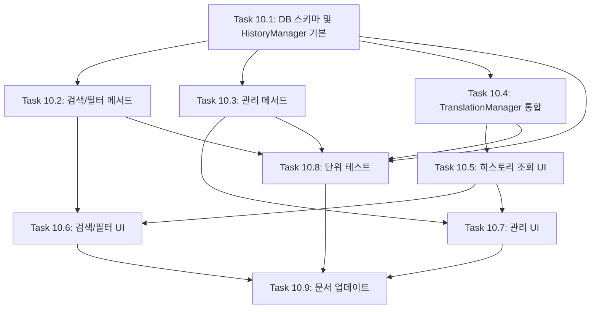

# FEATURE-010: 번역 히스토리 저장 및 관리

## 개요

- **기능명**: 번역 히스토리 저장 및 관리
- **상태**: 🔲 예정
- **분류**: 백엔드 + 프론트엔드
- **우선순위**: P1
- **진행률**: 0%
- **예상 시간**: 12시간
- **시작일**: TBD
- **완료일**: TBD

## 기능 설명

번역한 모든 내용을 로컬 SQLite 데이터베이스에 자동 저장하고, 사용자가 과거 번역 내역을 조회, 검색, 재사용할 수 있는 기능입니다. 즐겨찾기 등 향후 고급 기능의 기반 인프라로 활용됩니다.

## 배경 및 필요성

### 현재 문제점

- 번역 결과가 세션에만 저장되어 페이지 새로고침 시 사라짐
- 과거 번역 내역을 다시 확인하거나 재사용할 수 없음
- 번역 작업의 이력 관리가 불가능

### 개선 효과

- 번역 히스토리를 영구적으로 보존
- 과거 번역 내용을 빠르게 검색 및 재사용
- 번역 패턴 분석 및 즐겨찾기 기능의 기반 마련
- 업무 효율성 향상 (같은 내용을 다시 번역하는 중복 작업 방지)

## 요구사항

### 기능 요구사항 (Functional Requirements)

#### FR-1: 히스토리 자동 저장

- 번역이 완료되면 자동으로 데이터베이스에 저장
- 저장 항목:
  - 원문 텍스트
  - 번역문 텍스트
  - 원본 언어 (source_lang)
  - 대상 언어 (target_lang)
  - 사용한 AI 모델 (model)
  - 입력 토큰 수 (input_tokens)
  - 출력 토큰 수 (output_tokens)
  - 생성 일시 (created_at)
  - 고유 ID (id)

#### FR-2: 히스토리 조회

- 최근 번역 내역을 시간순으로 표시 (최신순)
- 페이징 기능 (초기 20개, 더보기 버튼)
- 각 항목 표시 정보:
  - 번역 방향 (🇰🇷 → 🇺🇸)
  - 원문 요약 (첫 50자)
  - 번역문 요약 (첫 50자)
  - 생성 일시
  - 사용 모델

#### FR-3: 히스토리 검색

- 원문 또는 번역문에서 키워드 검색
- 검색 결과 하이라이팅
- 검색 결과 없을 때 안내 메시지

#### FR-4: 히스토리 필터링

- 번역 방향별 필터 (전체, 한→영, 영→한)
- 날짜 범위 필터 (오늘, 최근 7일, 최근 30일, 전체)
- AI 모델별 필터

#### FR-5: 히스토리 관리

- 개별 항목 삭제 (확인 다이얼로그 포함)
- 전체 히스토리 삭제 (확인 다이얼로그 포함)
- 히스토리 항목 클릭 시 상세 보기 (전체 원문/번역문 표시)

#### FR-6: 히스토리 재사용

- 히스토리 항목 클릭 시 원문을 입력창에 복사
- "다시 번역" 버튼 (동일 설정으로 재번역)

### 비기능 요구사항 (Non-Functional Requirements)

#### NFR-1: 성능

- 히스토리 조회 응답 시간: 1초 이내
- 검색 응답 시간: 2초 이내
- 페이징으로 대량 데이터 처리

#### NFR-2: 확장성

- 1만 개 이상의 히스토리 항목 관리 가능
- 데이터베이스 인덱싱으로 검색 성능 유지
- 향후 즐겨찾기, 태그 기능 확장 가능한 스키마

#### NFR-3: 사용성

- 직관적인 UI (사이드바 또는 메인 영역)
- 모바일 친화적 레이아웃 (반응형)
- 키보드 단축키 지원 (선택 사항)

#### NFR-4: 데이터 무결성

- SQLite 트랜잭션으로 데이터 일관성 보장
- 에러 발생 시 롤백
- 데이터베이스 백업 방법 문서화

## 기술 스택

### 저장소

- **SQLite 3**: 경량 파일 기반 관계형 데이터베이스
- **Python sqlite3 모듈**: 표준 라이브러리

### 백엔드

- **HistoryManager 클래스**: 히스토리 CRUD 관리
- **데이터베이스 위치**: `./transbot_history.db`

### 프론트엔드

- **Streamlit expander**: 접고 펼칠 수 있는 히스토리 섹션
- **st.dataframe** 또는 **st.table**: 히스토리 목록 표시
- **st.text_input**: 검색창
- **st.selectbox**: 필터 드롭다운

## 데이터베이스 설계

### 테이블: `translation_history`

```sql
CREATE TABLE IF NOT EXISTS translation_history (
    id INTEGER PRIMARY KEY AUTOINCREMENT,
    source_text TEXT NOT NULL,
    translated_text TEXT NOT NULL,
    source_lang TEXT NOT NULL,
    target_lang TEXT NOT NULL,
    model TEXT NOT NULL,
    input_tokens INTEGER,
    output_tokens INTEGER,
    created_at TIMESTAMP DEFAULT CURRENT_TIMESTAMP,
    is_favorite BOOLEAN DEFAULT 0,  -- 향후 즐겨찾기 기능 대비
    tags TEXT  -- 향후 태그 기능 대비 (JSON 배열)
);

-- 인덱스
CREATE INDEX IF NOT EXISTS idx_created_at ON translation_history(created_at DESC);
CREATE INDEX IF NOT EXISTS idx_source_lang ON translation_history(source_lang);
CREATE INDEX IF NOT EXISTS idx_target_lang ON translation_history(target_lang);
CREATE INDEX IF NOT EXISTS idx_model ON translation_history(model);
CREATE INDEX IF NOT EXISTS idx_favorite ON translation_history(is_favorite);
```

### 데이터 모델 (Python)

```python
@dataclass
class TranslationHistory:
    """번역 히스토리 데이터 모델"""
    id: Optional[int] = None
    source_text: str = ""
    translated_text: str = ""
    source_lang: str = ""
    target_lang: str = ""
    model: str = ""
    input_tokens: int = 0
    output_tokens: int = 0
    created_at: Optional[datetime] = None
    is_favorite: bool = False
    tags: Optional[List[str]] = None
```

## 아키텍처 설계

### 컴포넌트 구조

```text
transbot/
├── components/
│   ├── history.py              # HistoryManager 클래스 (신규)
│   └── translation.py          # TranslationManager (수정: 히스토리 저장 연동)
├── app.py                      # UI 추가: 히스토리 섹션
├── tests/
│   └── test_history.py         # 히스토리 단위 테스트 (신규)
└── transbot_history.db         # SQLite 데이터베이스 파일 (신규, .gitignore 추가)
```

### HistoryManager 클래스 설계

```python
class HistoryManager:
    """번역 히스토리 관리 클래스"""

    def __init__(self, db_path: str = "./transbot_history.db"):
        """초기화 및 데이터베이스 연결"""
        pass

    def save(self, history: TranslationHistory) -> int:
        """히스토리 저장, 생성된 ID 반환"""
        pass

    def get_all(self, limit: int = 20, offset: int = 0) -> List[TranslationHistory]:
        """모든 히스토리 조회 (페이징)"""
        pass

    def search(self, keyword: str, limit: int = 20) -> List[TranslationHistory]:
        """키워드로 히스토리 검색"""
        pass

    def filter_by_direction(self, source_lang: str, target_lang: str, limit: int = 20) -> List[TranslationHistory]:
        """번역 방향으로 필터링"""
        pass

    def filter_by_date_range(self, days: int, limit: int = 20) -> List[TranslationHistory]:
        """날짜 범위로 필터링 (최근 N일)"""
        pass

    def filter_by_model(self, model: str, limit: int = 20) -> List[TranslationHistory]:
        """AI 모델로 필터링"""
        pass

    def get_by_id(self, history_id: int) -> Optional[TranslationHistory]:
        """ID로 단일 히스토리 조회"""
        pass

    def delete(self, history_id: int) -> bool:
        """히스토리 삭제"""
        pass

    def delete_all(self) -> int:
        """전체 히스토리 삭제, 삭제된 개수 반환"""
        pass

    def get_statistics(self) -> dict:
        """히스토리 통계 (총 개수, 모델별 사용 횟수 등)"""
        pass
```

### UI 레이아웃 설계

#### 옵션 1: 사이드바에 히스토리 탭 추가

```python
with st.sidebar:
    tab1, tab2 = st.tabs(["설정", "히스토리"])

    with tab1:
        # 기존 설정 내용

    with tab2:
        # 히스토리 UI
```

#### 옵션 2: 메인 영역 하단에 Expander 추가

```python
with st.expander("📜 번역 히스토리", expanded=False):
    # 히스토리 UI
```

**권장**: 옵션 2 (메인 영역 하단) - 더 넓은 공간 활용 가능

## 작업(Task) 분해

### Task 10.1: 데이터베이스 스키마 및 HistoryManager 클래스 구현 (백엔드)

**설명**: SQLite 테이블 생성 및 HistoryManager 클래스 기본 구조 구현

**세부 작업**:

1. `components/history.py` 파일 생성
2. TranslationHistory 데이터 클래스 정의
3. HistoryManager 클래스 기본 구조 작성
4. `__init__()`: 데이터베이스 연결 및 테이블 생성
5. `save()` 메서드 구현 (INSERT)
6. `get_all()` 메서드 구현 (SELECT with LIMIT/OFFSET)
7. `get_by_id()` 메서드 구현 (SELECT by ID)
8. 에러 핸들링 (트랜잭션, 롤백)

**예상 시간**: 2.5시간

**의존성**: 없음

**테스트 범위**:

- 데이터베이스 파일 생성 확인
- 테이블 스키마 검증
- CRUD 기본 동작 테스트

**완료 조건**:

- HistoryManager 클래스 구현 완료
- save, get_all, get_by_id 메서드 동작
- 단위 테스트 통과

---

### Task 10.2: 검색 및 필터링 메서드 구현 (백엔드)

**설명**: 히스토리 검색, 날짜/방향/모델별 필터링 기능 구현

**세부 작업**:

1. `search()` 메서드 구현 (LIKE 쿼리)
2. `filter_by_direction()` 메서드 구현
3. `filter_by_date_range()` 메서드 구현
4. `filter_by_model()` 메서드 구현
5. SQL 인덱스 활용 최적화
6. 검색 결과 하이라이팅 로직 (선택 사항)

**예상 시간**: 2시간

**의존성**: Task 10.1 완료

**테스트 범위**:

- 키워드 검색 정확도
- 필터링 조합 테스트
- 성능 테스트 (1000개 항목 기준)

**완료 조건**:

- 모든 검색/필터 메서드 동작
- 검색 응답 시간 2초 이내
- 단위 테스트 통과

---

### Task 10.3: 히스토리 관리 메서드 구현 (백엔드)

**설명**: 삭제, 통계 조회 등 관리 기능 구현

**세부 작업**:

1. `delete()` 메서드 구현 (DELETE by ID)
2. `delete_all()` 메서드 구현 (DELETE ALL)
3. `get_statistics()` 메서드 구현
   - 총 히스토리 개수
   - 모델별 사용 횟수
   - 번역 방향별 통계
   - 최근 7일/30일 사용량
4. 트랜잭션 처리 강화

**예상 시간**: 1.5시간

**의존성**: Task 10.1 완료

**테스트 범위**:

- 삭제 동작 확인
- 통계 정확도 검증
- 트랜잭션 롤백 테스트

**완료 조건**:

- 모든 관리 메서드 동작
- 통계 정보 정확
- 단위 테스트 통과

---

### Task 10.4: TranslationManager 통합 (백엔드)

**설명**: 번역 완료 시 자동으로 히스토리 저장되도록 연동

**세부 작업**:

1. `components/translation.py` 수정
2. TranslationManager에 HistoryManager 인스턴스 추가
3. `translate()` 메서드에 히스토리 저장 로직 추가
4. 토큰 수 계산 및 메타데이터 수집
5. 에러 발생 시에도 번역은 계속되도록 예외 처리

**예상 시간**: 1시간

**의존성**: Task 10.1 완료

**테스트 범위**:

- 번역 후 히스토리 자동 저장 확인
- 메타데이터 정확도 검증
- 에러 시 번역 계속 진행 확인

**완료 조건**:

- 번역 시 히스토리 자동 저장
- 기존 번역 기능 정상 동작
- 통합 테스트 통과

---

### Task 10.5: 히스토리 조회 UI 구현 (프론트엔드)

**설명**: 메인 영역 하단에 히스토리 섹션 추가 및 목록 표시

**세부 작업**:

1. `app.py`에 히스토리 섹션 추가 (st.expander 사용)
2. HistoryManager 인스턴스 초기화
3. `render_history_list()` 함수 구현
   - 최근 20개 히스토리 표시
   - 각 항목: 번역 방향, 원문 요약, 번역문 요약, 날짜, 모델
   - "더보기" 버튼으로 추가 로딩
4. 히스토리 항목 클릭 시 상세 보기 (st.expander 또는 모달)
5. 빈 히스토리 상태 처리 (안내 메시지)

**예상 시간**: 2시간

**의존성**: Task 10.1, 10.4 완료

**테스트 범위**:

- UI 렌더링 확인
- 항목 클릭 동작 확인
- 페이징 동작 확인

**완료 조건**:

- 히스토리 목록 정상 표시
- 상세 보기 동작
- UI 반응성 확인

---

### Task 10.6: 검색 및 필터링 UI 구현 (프론트엔드)

**설명**: 검색창과 필터 드롭다운 추가

**세부 작업**:

1. 검색창 추가 (st.text_input)
2. 번역 방향 필터 (st.selectbox)
   - 전체, 한국어 → 영어, 영어 → 한국어
3. 날짜 범위 필터 (st.selectbox)
   - 전체, 오늘, 최근 7일, 최근 30일
4. AI 모델 필터 (st.multiselect)
5. 필터 적용 버튼 (st.button)
6. 검색 결과 하이라이팅 (HTML 사용)
7. 검색 결과 없을 때 안내 메시지

**예상 시간**: 2시간

**의존성**: Task 10.2, 10.5 완료

**테스트 범위**:

- 검색 동작 확인
- 필터 조합 동작 확인
- 결과 하이라이팅 확인

**완료 조건**:

- 검색 및 필터 UI 동작
- 검색 결과 정확
- 사용자 피드백 제공

---

### Task 10.7: 히스토리 관리 UI 구현 (프론트엔드)

**설명**: 삭제 버튼 및 재사용 기능 추가

**세부 작업**:

1. 각 히스토리 항목에 삭제 버튼 추가 (아이콘 버튼)
2. 삭제 확인 다이얼로그 (st.warning + st.button)
3. "전체 삭제" 버튼 추가 (위험한 동작이므로 경고 표시)
4. 히스토리 항목 클릭 시 "원문 복사" 버튼
5. "다시 번역" 버튼 (동일 설정으로 재번역)
6. 통계 섹션 (총 개수, 모델별 사용 횟수)

**예상 시간**: 1.5시간

**의존성**: Task 10.3, 10.5 완료

**테스트 범위**:

- 삭제 동작 확인
- 재사용 기능 확인
- 통계 표시 확인

**완료 조건**:

- 모든 관리 기능 동작
- 사용자 피드백 제공
- 데이터 무결성 유지

---

### Task 10.8: 단위 테스트 작성 (테스트)

**설명**: HistoryManager 클래스 및 통합 테스트 작성

**세부 작업**:

1. `tests/test_history.py` 파일 생성
2. HistoryManager CRUD 테스트 (15개 테스트)
   - save, get_all, get_by_id
   - search, filter_by_direction, filter_by_date_range, filter_by_model
   - delete, delete_all
   - get_statistics
3. 에러 케이스 테스트 (잘못된 입력, DB 연결 실패 등)
4. 통합 테스트 (TranslationManager + HistoryManager)
5. 성능 테스트 (1000개 항목 기준)
6. 커버리지 80% 이상 달성

**예상 시간**: 2시간

**의존성**: Task 10.1~10.4 완료

**테스트 범위**:

- 모든 메서드 단위 테스트
- 에러 케이스 커버
- 성능 기준 충족

**완료 조건**:

- 모든 테스트 통과
- 커버리지 80% 이상
- pytest HTML 리포트 생성

---

### Task 10.9: 문서 업데이트 (문서화)

**설명**: README, PRD, CLAUDE 문서 업데이트

**세부 작업**:

1. **README.md** 업데이트
   - 히스토리 기능 사용법 추가
   - 스크린샷 추가 (선택 사항)
   - 데이터베이스 위치 안내
   - 백업 방법 안내
2. **PRD.md** 업데이트
   - FEATURE-010 완료 표시
   - 기술 스택 업데이트
3. **CLAUDE.md** 업데이트
   - HistoryManager 개발 가이드 추가
   - 데이터베이스 관리 가이드
   - 테스트 작성 가이드
4. **.gitignore** 업데이트
   - `transbot_history.db` 추가

**예상 시간**: 1시간

**의존성**: Task 10.1~10.8 완료

**테스트 범위**:

- Markdownlint 규칙 준수
- 링크 유효성 확인
- 정보 정확도 검증

**완료 조건**:

- 모든 문서 업데이트 완료
- Markdownlint 통과
- 정보 일관성 유지

---

## 작업 순서 및 의존성



### 병렬 작업 가능

- Task 10.2, 10.3은 Task 10.1 완료 후 병렬 진행 가능
- Task 10.6, 10.7은 Task 10.5 완료 후 병렬 진행 가능

## 진행 현황

### Task별 완료 상태

| Task | 제목 | 상태 | 예상 시간 | 실제 시간 | 완료일 | 커밋 | 이슈 |
| ---- | ---- | ---- | --------- | --------- | ------ | ---- | ---- |
| 10.1 | DB 스키마 및 HistoryManager 기본 구현 | 🔲 예정 | 2.5h | - | - | - | - |
| 10.2 | 검색/필터 메서드 구현 | 🔲 예정 | 2h | - | - | - | - |
| 10.3 | 관리 메서드 구현 | 🔲 예정 | 1.5h | - | - | - | - |
| 10.4 | TranslationManager 통합 | 🔲 예정 | 1h | - | - | - | - |
| 10.5 | 히스토리 조회 UI 구현 | 🔲 예정 | 2h | - | - | - | - |
| 10.6 | 검색/필터 UI 구현 | 🔲 예정 | 2h | - | - | - | - |
| 10.7 | 관리 UI 구현 | 🔲 예정 | 1.5h | - | - | - | - |
| 10.8 | 단위 테스트 작성 | 🔲 예정 | 2h | - | - | - | - |
| 10.9 | 문서 업데이트 | 🔲 예정 | 1h | - | - | - | - |

### 전체 진행률

- **예상 총 시간**: 15.5시간
- **실제 소요 시간**: -
- **진행률**: 0% (0/9 완료)

### 주요 마일스톤

- 🔲 **Phase 1 완료**: 백엔드 인프라 (Task 10.1~10.4)
- 🔲 **Phase 2 완료**: 프론트엔드 UI (Task 10.5~10.7)
- 🔲 **Phase 3 완료**: 테스트 및 문서화 (Task 10.8~10.9)

## 리스크 및 대응 방안

### 리스크 1: 성능 저하 (대량 데이터)

**가능성**: 중간

**영향**: 높음

**대응 방안**:

- 데이터베이스 인덱싱 활용
- 페이징으로 한 번에 로드하는 데이터 제한
- 필요시 전체 텍스트 검색(FTS) 확장 고려

### 리스크 2: 데이터베이스 파일 손상

**가능성**: 낮음

**영향**: 높음

**대응 방안**:

- SQLite WAL(Write-Ahead Logging) 모드 활성화
- 트랜잭션으로 데이터 무결성 보장
- 주기적 백업 가이드 제공

### 리스크 3: UI 복잡도 증가

**가능성**: 중간

**영향**: 중간

**대응 방안**:

- 히스토리 섹션을 접을 수 있도록 st.expander 사용
- 필터/검색 UI를 단계적으로 추가
- 사용자 피드백 반영하여 반복 개선

## 향후 확장 계획

### Phase 2.5: 즐겨찾기 기능 (FEATURE-012)

- `is_favorite` 컬럼 활용
- 즐겨찾기 토글 버튼 추가
- 즐겨찾기만 필터링하는 탭

### Phase 3: 태그 및 카테고리

- `tags` 컬럼 활용 (JSON 배열)
- 태그 자동 추천 (AI 기반)
- 태그별 그룹핑

### Phase 3: 내보내기 기능

- CSV 내보내기
- JSON 내보내기
- 외부 툴 연동 (FEATURE-014 기반)

## 참고 자료

### SQLite 공식 문서

- [SQLite 공식 사이트](https://www.sqlite.org/)
- [Python sqlite3 모듈](https://docs.python.org/3/library/sqlite3.html)

### Streamlit UI 컴포넌트

- [st.expander](https://docs.streamlit.io/library/api-reference/layout/st.expander)
- [st.dataframe](https://docs.streamlit.io/library/api-reference/data/st.dataframe)
- [st.text_input](https://docs.streamlit.io/library/api-reference/widgets/st.text_input)

---

**작성일**: 2026년 1월 30일
**최종 수정일**: 2026년 1월 30일
**작성자**: TransBot Development Team
