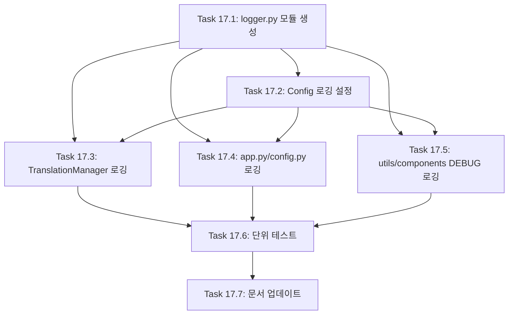

# FEATURE-017: 구조화된 로깅 시스템

## 개요

- **기능명**: 구조화된 로깅 시스템
- **상태**: 🔲 계획 중
- **분류**: 백엔드 + 운영
- **우선순위**: P1
- **진행률**: 0%
- **예상 시간**: 6.5시간
- **시작일**: TBD
- **완료일**: TBD

## 기능 설명

Python 표준 `logging` 모듈을 기반으로 구조화된 로깅 시스템을 구축합니다. API 호출, 에러, 사용자 행동 등 주요 이벤트를 체계적으로 기록하여 디버깅, 모니터링, 비용 분석을 가능하게 합니다.

## 배경 및 필요성

### 현재 문제점

1. **디버깅 어려움**: 에러 발생 시 원인 파악이 어려움
2. **모니터링 부재**: API 호출 성공/실패율, 응답 시간 추적 불가
3. **운영 가시성 부족**: 실제 사용 패턴, 성능 병목 지점 파악 불가
4. **에러 추적 불가**: 어떤 입력이 어떤 에러를 발생시켰는지 추적 불가
5. **비용 모니터링 어려움**: OpenAI/Azure API 토큰 소비량 추적 불가

### 기대 효과

- 에러 발생 시 빠른 원인 파악 및 해결
- API 호출 패턴 및 성능 분석
- 운영 환경에서의 안정성 향상
- 비용 최적화 (토큰 사용량 분석)
- 사용자 행동 패턴 분석 (선택적)

## 요구사항

### 기능 요구사항 (FR)

#### FR-1: 로깅 인프라 구축

**Python 표준 logging 모듈 기반**

```python
# 로거 계층 구조
transbot (루트)
├── transbot.api (API 호출)
├── transbot.translation (번역 관리)
├── transbot.config (설정 관리)
└── transbot.ui (UI 이벤트)
```

**Config 클래스 통합 (.env 설정)**

```bash
LOG_LEVEL=INFO                    # DEBUG, INFO, WARNING, ERROR, CRITICAL
LOG_FORMAT=json                   # "json" or "text"
LOG_FILE_PATH=logs/transbot.log
LOG_FILE_MAX_BYTES=10485760       # 10MB
LOG_FILE_BACKUP_COUNT=5
LOG_CONSOLE_OUTPUT=true
```

#### FR-2: 로깅 레벨별 분류

| 레벨 | 용도 | 예시 |
| ---- | ---- | ---- |
| **DEBUG** | 개발 디버깅 | 함수 호출, 변수 값 |
| **INFO** | 정상 동작 기록 | API 호출 성공, 번역 완료 |
| **WARNING** | 주의 필요 | 입력 길이 80% 초과, Retry 발생 |
| **ERROR** | 에러 발생 | API 호출 실패, 번역 에러 |
| **CRITICAL** | 치명적 오류 | 설정 로드 실패, 클라이언트 생성 실패 |

#### FR-3: 로깅 대상 이벤트

**API 호출 로깅**

```python
# 시작
logger.info("번역 API 호출 시작", extra={
    "provider": "openai",
    "model": "gpt-4o-mini",
    "source_lang": "Korean",
    "target_lang": "English",
    "input_length": 150,
    "temperature": 0.3
})

# 성공
logger.info("번역 API 호출 성공", extra={
    "provider": "openai",
    "model": "gpt-4o-mini",
    "response_time_ms": 1234,
    "output_length": 180,
    "prompt_tokens": 45,
    "completion_tokens": 52,
    "total_tokens": 97
})

# 실패
logger.error("번역 API 호출 실패", extra={
    "provider": "azure",
    "error_type": "TimeoutError",
    "error_message": "Request timeout after 60s",
    "input_length": 5000
}, exc_info=True)
```

**설정 로드 로깅**

```python
logger.info("설정 로드 완료", extra={
    "provider": "openai",
    "default_model": "gpt-4o-mini",
    "max_input_length": 50000,
    "log_level": "INFO"
})
```

**사용자 행동 로깅 (선택적)**

```python
logger.info("번역 요청", extra={
    "detected_language": "Korean",
    "translation_direction": "Korean -> English",
    "character_count": 256
})
```

#### FR-4: 구조화된 로그 포맷

**JSON 포맷 (운영 환경 권장)**

```json
{
  "timestamp": "2026-01-30T12:34:56.789Z",
  "level": "INFO",
  "logger": "transbot.api",
  "message": "번역 API 호출 성공",
  "provider": "openai",
  "model": "gpt-4o-mini",
  "response_time_ms": 1234,
  "total_tokens": 97
}
```

**텍스트 포맷 (개발 환경)**

```text
2026-01-30 12:34:56,789 - transbot.api - INFO - 번역 API 호출 성공 - provider=openai model=gpt-4o-mini total_tokens=97
```

#### FR-5: 로그 출력 및 저장

**다중 핸들러 지원**

1. **콘솔 출력**: 개발 환경에서 실시간 확인
2. **파일 출력**: 운영 환경에서 영구 저장
3. **로테이션**: 파일 크기 기반 자동 로테이션 (10MB)

**파일 구조**

```text
logs/
├── transbot.log          # 현재 로그
├── transbot.log.1        # 백업 1
├── transbot.log.2        # 백업 2
├── transbot.log.3        # 백업 3
├── transbot.log.4        # 백업 4
└── transbot.log.5        # 백업 5 (최대)
```

#### FR-6: 민감정보 마스킹

**자동 마스킹 대상**

- API 키: `sk-proj-abc...xyz` → `sk-***...***xyz`
- Azure Endpoint: `https://my-resource.openai.azure.com/` → `https://*****.openai.azure.com/`
- 사용자 입력 텍스트: 로깅하지 않거나 길이만 기록

### 비기능 요구사항 (NFR)

#### NFR-1: 성능 영향 최소화

- 로깅으로 인한 성능 저하 5% 이내
- DEBUG 레벨은 개발 환경에서만 사용
- 파일 핸들러는 버퍼링 활용

#### NFR-2: 로그 파일 관리

- 자동 로테이션 (크기 기반: 10MB)
- 백업 파일 최대 5개 유지
- 오래된 로그 자동 삭제

#### NFR-3: 설정 유연성

- .env 파일로 모든 로깅 설정 관리
- 환경별 (dev/prod) 다른 설정 적용 가능
- 코드 변경 없이 로그 레벨 조정

#### NFR-4: 호환성

- Python 3.8+ 표준 logging 모듈 사용
- 외부 의존성 최소화 (추가 라이브러리 불필요)
- Streamlit 환경과의 호환성

## 작업(Task) 분해

### Task 17.1: logger.py 모듈 생성 (백엔드)

**설명**: 로깅 시스템 초기화 모듈 작성

**세부 작업**:

1. `logger.py` 파일 생성
2. `JSONFormatter` 클래스 구현
3. `setup_logging()` 함수 구현
   - 루트 로거 설정
   - 콘솔 핸들러 추가
   - 파일 핸들러 추가 (RotatingFileHandler)
4. `get_logger()` 함수 구현
5. `mask_sensitive_data()` 함수 구현

**예상 시간**: 1.5시간

**의존성**: FEATURE-009 (Config 클래스)

**테스트 범위**:

- JSONFormatter 정상 동작 확인
- setup_logging() 호출 시 핸들러 생성 확인
- 민감정보 마스킹 확인

**완료 조건**:

- logger.py 모듈 구현 완료
- 단위 테스트 작성 및 통과

---

### Task 17.2: Config 클래스에 로깅 설정 추가 (백엔드)

**설명**: config.py에 로깅 관련 환경 변수 추가

**세부 작업**:

1. Config 클래스에 로깅 설정 변수 추가
   - `LOG_LEVEL`, `LOG_FORMAT`, `LOG_FILE_PATH`
   - `LOG_FILE_MAX_BYTES`, `LOG_FILE_BACKUP_COUNT`
   - `LOG_CONSOLE_OUTPUT`
2. `load()` 메서드에 로깅 설정 로딩 로직 추가
3. `.env.example` 업데이트

**예상 시간**: 30분

**의존성**: Task 17.1

**테스트 범위**:

- Config.load()에서 로깅 설정 로드 확인
- 기본값 적용 확인

**완료 조건**:

- config.py 수정 완료
- .env.example 업데이트 완료
- 테스트 통과

---

### Task 17.3: TranslationManager에 로깅 적용 (백엔드)

**설명**: components/translation.py에 API 호출 로깅 추가

**세부 작업**:

1. TranslationManager.translate() 메서드에 로깅 추가
   - API 호출 시작 로깅 (INFO)
   - API 호출 성공 로깅 (INFO, 응답 시간, 토큰 사용량)
   - API 호출 실패 로깅 (ERROR, 스택 트레이스)
2. AzureTranslationManager.translate() 메서드에 로깅 추가
3. 응답 시간 측정 (`time.time()`)

**예상 시간**: 1시간

**의존성**: Task 17.1, 17.2

**테스트 범위**:

- 로그 메시지 정상 출력 확인
- extra 필드 포함 확인
- 에러 발생 시 스택 트레이스 확인

**완료 조건**:

- translation.py 수정 완료
- 로깅 동작 확인

---

### Task 17.4: app.py 및 config.py에 로깅 적용 (백엔드)

**설명**: 주요 함수에 로깅 추가

**세부 작업**:

1. `app.py`
   - `setup_api_client()`: 클라이언트 생성 성공/실패 로깅
   - `handle_translation()`: 번역 요청/완료/실패 로깅
   - `main()`: 애플리케이션 시작 로깅
2. `config.py`
   - `Config.load()`: 설정 로드 성공 로깅
   - Provider 검증 실패 로깅 (CRITICAL)

**예상 시간**: 1시간

**의존성**: Task 17.1, 17.2

**테스트 범위**:

- 주요 함수 호출 시 로그 생성 확인
- 에러 발생 시 로그 확인

**완료 조건**:

- app.py, config.py 수정 완료
- 로깅 동작 확인

---

### Task 17.5: utils.py 및 components에 DEBUG 로깅 추가 (선택적)

**설명**: 유틸리티 함수와 컴포넌트에 DEBUG 레벨 로깅 추가

**세부 작업**:

1. `utils.py`
   - `detect_language()`: 감지 결과 로깅 (DEBUG)
   - `count_tokens()`: 토큰 수 로깅 (DEBUG)
2. `components/language.py`
   - `get_translation_direction()`: 번역 방향 로깅 (DEBUG)
3. `components/text.py`
   - `get_statistics()`: 통계 계산 로깅 (DEBUG)

**예상 시간**: 30분

**의존성**: Task 17.1, 17.2

**테스트 범위**:

- DEBUG 레벨 설정 시 로그 출력 확인
- INFO 레벨 설정 시 DEBUG 로그 미출력 확인

**완료 조건**:

- utils.py, components 수정 완료
- DEBUG 로깅 동작 확인

---

### Task 17.6: 단위 테스트 작성 (테스트)

**설명**: 로깅 시스템 단위 테스트 작성

**세부 작업**:

1. **test_logger.py** (신규, 10개 테스트)
   - `JSONFormatter` 테스트
   - `setup_logging()` 테스트
   - 핸들러 생성 테스트
   - `mask_sensitive_data()` 테스트
2. **test_translation.py** (로깅 검증 추가, 5개)
   - API 호출 로그 확인
   - 에러 로그 확인
3. 커버리지 80% 이상 유지

**예상 시간**: 1.5시간

**의존성**: Task 17.1 ~ 17.5

**테스트 범위**:

- 로그 메시지 형식 검증
- 로그 레벨 필터링 확인
- 파일 로테이션 확인

**완료 조건**:

- 모든 단위 테스트 통과
- 커버리지 80% 이상
- pytest HTML 리포트 생성

---

### Task 17.7: 문서 업데이트 (문서화)

**설명**: README, CLAUDE 문서에 로깅 시스템 설명 추가

**세부 작업**:

1. **README.md**
   - 로깅 설정 가이드 추가
   - 로그 파일 위치 안내
   - 로그 레벨 설정 방법
2. **CLAUDE.md**
   - 로깅 시스템 개발 가이드 추가
   - 로거 사용 방법 예시
   - 로깅 모범 사례
3. **PRD.md**
   - FEATURE-017 완료 표시 (구현 후)
4. **.env.example**
   - 로깅 관련 변수 추가 및 주석

**예상 시간**: 30분

**의존성**: Task 17.1 ~ 17.6

**테스트 범위**:

- Markdownlint 규칙 준수
- 정보 정확도 검증

**완료 조건**:

- 모든 문서 업데이트 완료
- Markdownlint 통과

---

## 작업 순서 및 의존성



### 병렬 작업 가능

- Task 17.3, 17.4, 17.5는 Task 17.2 완료 후 병렬 진행 가능

## 구현 예시

### logger.py 모듈

```python
"""로깅 설정 모듈"""
import logging
import logging.handlers
import json
from pathlib import Path
from typing import Dict, Any
from config import Config


class JSONFormatter(logging.Formatter):
    """JSON 포맷 로거"""

    def format(self, record: logging.LogRecord) -> str:
        log_data = {
            "timestamp": self.formatTime(record, self.datefmt),
            "level": record.levelname,
            "logger": record.name,
            "message": record.getMessage(),
        }

        # extra 필드 추가
        excluded_keys = {
            "name", "msg", "args", "created", "filename",
            "funcName", "levelname", "levelno", "lineno",
            "module", "msecs", "pathname", "process",
            "processName", "relativeCreated", "thread",
            "threadName", "exc_info", "exc_text", "stack_info"
        }

        for key, value in record.__dict__.items():
            if key not in excluded_keys:
                log_data[key] = value

        # 예외 정보 추가
        if record.exc_info:
            log_data["exception"] = self.formatException(record.exc_info)

        return json.dumps(log_data, ensure_ascii=False)


def setup_logging(config: Config) -> None:
    """로깅 시스템을 초기화합니다.

    Args:
        config: Config 인스턴스
    """
    # 루트 로거 설정
    logger = logging.getLogger("transbot")
    logger.setLevel(getattr(logging, config.LOG_LEVEL.upper()))
    logger.handlers.clear()  # 기존 핸들러 제거

    # 포맷터 선택
    if config.LOG_FORMAT == "json":
        formatter = JSONFormatter()
    else:
        formatter = logging.Formatter(
            "%(asctime)s - %(name)s - %(levelname)s - %(message)s"
        )

    # 콘솔 핸들러
    if config.LOG_CONSOLE_OUTPUT:
        console_handler = logging.StreamHandler()
        console_handler.setFormatter(formatter)
        logger.addHandler(console_handler)

    # 파일 핸들러 (로테이션)
    if config.LOG_FILE_PATH:
        log_dir = Path(config.LOG_FILE_PATH).parent
        log_dir.mkdir(parents=True, exist_ok=True)

        file_handler = logging.handlers.RotatingFileHandler(
            config.LOG_FILE_PATH,
            maxBytes=config.LOG_FILE_MAX_BYTES,
            backupCount=config.LOG_FILE_BACKUP_COUNT,
            encoding="utf-8"
        )
        file_handler.setFormatter(formatter)
        logger.addHandler(file_handler)

    logger.info("로깅 시스템 초기화 완료", extra={
        "log_level": config.LOG_LEVEL,
        "log_format": config.LOG_FORMAT,
        "console_output": config.LOG_CONSOLE_OUTPUT,
        "file_output": bool(config.LOG_FILE_PATH)
    })


def get_logger(name: str) -> logging.Logger:
    """로거 인스턴스를 반환합니다.

    Args:
        name: 로거 이름 (예: "transbot.api")

    Returns:
        Logger 인스턴스
    """
    return logging.getLogger(name)


def mask_sensitive_data(data: Dict[str, Any]) -> Dict[str, Any]:
    """민감정보를 마스킹합니다.

    Args:
        data: 로깅할 데이터 딕셔너리

    Returns:
        마스킹된 데이터 딕셔너리
    """
    masked = data.copy()

    # API 키 마스킹
    if "api_key" in masked:
        key = masked["api_key"]
        if len(key) >= 10:
            masked["api_key"] = f"{key[:3]}***...***{key[-3:]}"
        else:
            masked["api_key"] = "***"

    # Endpoint 마스킹
    if "endpoint" in masked and "azure" in masked["endpoint"]:
        masked["endpoint"] = masked["endpoint"].replace(
            masked["endpoint"].split(".")[0].split("//")[-1],
            "*****"
        )

    return masked
```

### TranslationManager 로깅 적용

```python
# components/translation.py

import logging
import time
from typing import Optional
from config import Config

logger = logging.getLogger("transbot.translation")


class TranslationManager:
    def translate(self, text: str, source: str, target: str) -> str:
        input_length = len(text)

        # API 호출 시작 로깅
        logger.info(
            "번역 API 호출 시작",
            extra={
                "provider": "openai",
                "model": self.model,
                "source_lang": source,
                "target_lang": target,
                "input_length": input_length,
                "temperature": self.temperature
            }
        )

        try:
            start_time = time.time()

            response = self.client.chat.completions.create(
                model=self.model,
                messages=[
                    {
                        "role": "system",
                        "content": f"You are a professional translator. Translate the following {source} text to {target}. IMPORTANT: Preserve all Markdown formatting (bold, italic, headings, lists, links, code blocks, blockquotes, tables, etc.) in the translation. Only respond with the translation, nothing else."
                    },
                    {
                        "role": "user",
                        "content": text
                    }
                ],
                temperature=self.temperature,
                max_tokens=self.max_tokens,
                timeout=self.timeout
            )

            response_time_ms = int((time.time() - start_time) * 1000)
            result = response.choices[0].message.content

            # API 호출 성공 로깅
            logger.info(
                "번역 API 호출 성공",
                extra={
                    "provider": "openai",
                    "model": self.model,
                    "response_time_ms": response_time_ms,
                    "output_length": len(result),
                    "prompt_tokens": response.usage.prompt_tokens,
                    "completion_tokens": response.usage.completion_tokens,
                    "total_tokens": response.usage.total_tokens
                }
            )

            return result

        except Exception as e:
            # API 호출 실패 로깅
            logger.error(
                "번역 API 호출 실패",
                extra={
                    "provider": "openai",
                    "model": self.model,
                    "error_type": type(e).__name__,
                    "error_message": str(e),
                    "input_length": input_length
                },
                exc_info=True
            )
            raise
```

## .env 설정 예시

```bash
# ============================================================================
# 로깅 설정
# ============================================================================

# 로그 레벨 (DEBUG, INFO, WARNING, ERROR, CRITICAL)
LOG_LEVEL=INFO

# 로그 포맷 (json 또는 text)
# - json: 운영 환경 권장, 구조화된 데이터
# - text: 개발 환경 권장, 읽기 쉬운 형식
LOG_FORMAT=json

# 로그 파일 경로
LOG_FILE_PATH=logs/transbot.log

# 로그 파일 최대 크기 (바이트 단위, 기본 10MB)
LOG_FILE_MAX_BYTES=10485760

# 백업 로그 파일 개수 (기본 5개)
LOG_FILE_BACKUP_COUNT=5

# 콘솔 출력 여부 (true/false)
# - 개발: true, 운영: false 권장
LOG_CONSOLE_OUTPUT=true
```

## 완료 기준

### 기능 완료

- [ ] logger.py 모듈 구현 완료
- [ ] Config 클래스에 로깅 설정 추가 완료
- [ ] TranslationManager에 API 호출 로깅 적용
- [ ] app.py 주요 함수에 로깅 적용
- [ ] 민감정보 마스킹 동작 확인
- [ ] 로그 파일 로테이션 동작 확인

### 품질 완료

- [ ] 모든 단위 테스트 통과 (test_logger.py)
- [ ] 코드 커버리지 80% 이상 유지
- [ ] 로그 레벨별 필터링 정상 동작
- [ ] JSON/텍스트 포맷 정상 동작

### 문서 완료

- [ ] README.md에 로깅 설정 가이드 추가
- [ ] CLAUDE.md에 로깅 시스템 개발 가이드 추가
- [ ] .env.example 업데이트 완료

## 테스트 계획

### 테스트 케이스

| ID | 테스트 시나리오 | 예상 결과 |
| -- | --------------- | --------- |
| TC-1 | LOG_LEVEL=DEBUG 설정 | DEBUG 레벨 로그 출력 |
| TC-2 | LOG_LEVEL=INFO 설정 | DEBUG 로그 미출력, INFO 이상 출력 |
| TC-3 | LOG_FORMAT=json 설정 | JSON 형식 로그 출력 |
| TC-4 | LOG_FORMAT=text 설정 | 텍스트 형식 로그 출력 |
| TC-5 | API 호출 성공 | INFO 레벨 로그, 토큰 사용량 포함 |
| TC-6 | API 호출 실패 | ERROR 레벨 로그, 스택 트레이스 포함 |
| TC-7 | API 키 마스킹 | `sk-***...***xyz` 형식 |
| TC-8 | 로그 파일 10MB 초과 | 자동 로테이션 발생 |

### 단위 테스트 예시

```python
# tests/test_logger.py

import logging
import json
from logger import JSONFormatter, setup_logging, mask_sensitive_data


class TestJSONFormatter:
    """JSONFormatter 클래스 테스트"""

    def test_format_basic_message(self):
        """기본 메시지 포맷 테스트"""
        formatter = JSONFormatter()
        record = logging.LogRecord(
            name="test",
            level=logging.INFO,
            pathname="test.py",
            lineno=10,
            msg="Test message",
            args=(),
            exc_info=None
        )

        result = formatter.format(record)
        log_data = json.loads(result)

        assert log_data["level"] == "INFO"
        assert log_data["message"] == "Test message"
        assert "timestamp" in log_data

    def test_format_with_extra_fields(self):
        """extra 필드 포함 테스트"""
        formatter = JSONFormatter()
        record = logging.LogRecord(
            name="test",
            level=logging.INFO,
            pathname="test.py",
            lineno=10,
            msg="API call",
            args=(),
            exc_info=None
        )
        record.provider = "openai"
        record.model = "gpt-4o-mini"

        result = formatter.format(record)
        log_data = json.loads(result)

        assert log_data["provider"] == "openai"
        assert log_data["model"] == "gpt-4o-mini"


class TestMaskSensitiveData:
    """민감정보 마스킹 테스트"""

    def test_mask_api_key(self):
        """API 키 마스킹 테스트"""
        data = {"api_key": "sk-proj-abcdefghijklmnopqrstuvwxyz"}
        result = mask_sensitive_data(data)

        assert result["api_key"] == "sk-***...***xyz"
        assert "abcdefghijklmnopqrst" not in result["api_key"]

    def test_mask_azure_endpoint(self):
        """Azure Endpoint 마스킹 테스트"""
        data = {"endpoint": "https://my-resource.openai.azure.com/"}
        result = mask_sensitive_data(data)

        assert "my-resource" not in result["endpoint"]
        assert "*****" in result["endpoint"]
```

## 리스크 및 대응 방안

### 리스크 1: 성능 저하

**가능성**: 중간

**영향**: 중간

**대응 방안**:

- DEBUG 레벨은 개발 환경에서만 사용
- 파일 핸들러는 버퍼링 활용
- 과도한 로깅 지양 (필수 이벤트만)

### 리스크 2: 로그 파일 용량 증가

**가능성**: 높음

**영향**: 낮음

**대응 방안**:

- 자동 로테이션 설정 (10MB)
- 백업 파일 최대 5개로 제한
- 운영 환경에서는 INFO 레벨 사용

### 리스크 3: 민감정보 노출

**가능성**: 낮음

**영향**: 높음

**대응 방안**:

- API 키 자동 마스킹
- 사용자 입력 텍스트 로깅 최소화
- 로그 파일 접근 권한 제한

### 리스크 4: Streamlit 환경 호환성

**가능성**: 낮음

**영향**: 중간

**대응 방안**:

- Python 표준 logging 모듈 사용 (외부 의존성 없음)
- Streamlit 로깅과 충돌하지 않도록 네임스페이스 분리 (`transbot.*`)

## 참고 자료

### Python 공식 문서

- [Python logging Module](https://docs.python.org/3/library/logging.html)
- [Logging HOWTO](https://docs.python.org/3/howto/logging.html)
- [Logging Cookbook](https://docs.python.org/3/howto/logging-cookbook.html)

### TransBot 프로젝트 문서

- [FEATURE-009: 환경 변수 기반 설정 관리](FEATURE-009.md)
- [PRD.md](../product/PRD.md)
- [CLAUDE.md](../../CLAUDE.md)

---

**작성일**: 2026년 1월 31일
**최종 수정일**: 2026년 1월 31일
**작성자**: TransBot Development Team
