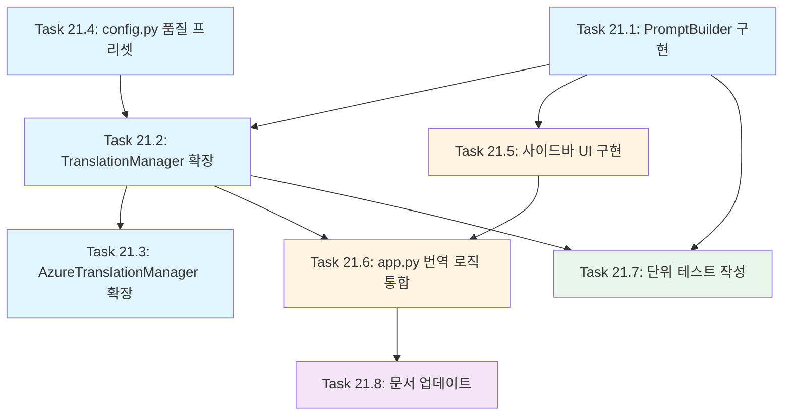

# FEATURE-021: 번역 품질 및 스타일 설정

## 개요

- **기능명**: 번역 품질 및 스타일 설정
- **상태**: 🔲 예정
- **분류**: 백엔드+프론트엔드
- **우선순위**: P2 (보통)
- **복잡도**: Complex (10h+)
- **분석 수준**: 완료
- **진행률**: 0%
- **예상 시간**: 12시간
- **실제 소요**: - (완료 후 기록)
- **시작일**: -
- **완료일**: -

## 기능 설명

사용자가 번역 품질과 스타일을 세밀하게 조정할 수 있는 설정 인터페이스를 제공합니다. 이를 통해 사용자는 자신의 번역 목적과 선호도에 맞게 번역 결과를 최적화할 수 있습니다.

### 핵심 가치

- **번역 품질 선택**: 속도와 정확도 간의 균형을 사용자가 직접 조절
- **스타일 조정**: 직역/의역 스펙트럼에서 원하는 지점 선택
- **문체 제어**: 비즈니스, 기술 문서, 일상 대화 등 상황에 맞는 톤 설정
- **일관성 보장**: 용어집 활용으로 전문 용어의 일관된 번역
- **포맷 보존**: 문서 구조와 특수 문자 유지로 후처리 최소화

## 배경 및 필요성

### 현재 상황

TransBot은 현재 단일 프롬프트로 모든 번역을 처리합니다:
- 모든 사용자에게 동일한 번역 스타일 제공
- temperature와 model만 조정 가능
- 문체, 형식 유지 등 세부 제어 불가

### 문제점

1. **사용 목적별 최적화 부족**: 기술 문서, 마케팅 문구, 일상 대화 등 다양한 용도에 대한 맞춤 설정 불가
2. **번역 품질 체감 부족**: 사용자가 "좋은 번역"을 위한 명확한 레버가 없음
3. **전문 용어 일관성**: 도메인 특화 용어의 일관된 번역 어려움
4. **포맷 손실 위험**: 복잡한 문서 구조나 특수 문자가 번역 중 손실될 수 있음

### 기대 효과

- 사용자가 자신의 워크플로우에 맞는 번역 품질 확보
- 전문 번역 도구 수준의 세밀한 제어 제공
- 번역 결과의 예측 가능성과 일관성 향상
- 후처리 작업 최소화로 생산성 증대

## 요구사항

### 기능 요구사항 (Functional Requirements)

#### FR-1: 번역 품질 프리셋

사용자는 3가지 품질 프리셋 중 선택 가능:

- **빠름 (Fast)**: 빠른 응답 속도, 기본적인 번역 품질
  - 모델: `gpt-4o-mini`
  - Temperature: `0.3`
  - 사용 사례: 빠른 초안, 대략적인 의미 파악

- **균형 (Balanced)**: 속도와 품질의 균형 (기본값)
  - 모델: `gpt-4o`
  - Temperature: `0.2`
  - 사용 사례: 일반적인 번역 작업

- **정확 (Accurate)**: 최고 품질, 느린 응답
  - 모델: `gpt-4o` + `reasoning_effort: "high"`
  - Temperature: `0.1`
  - 사용 사례: 공식 문서, 법률/의료 문서

#### FR-2: 번역 스타일 슬라이더

사용자는 직역과 의역 사이의 스펙트럼을 슬라이더로 선택 (0-10):

- **0-3 (직역, Literal)**: 원문 구조/의미 최대한 보존
  - 프롬프트: "원문의 구조와 의미를 최대한 보존하여 직역해주세요. 자연스럽지 않아도 원문에 충실하게."
- **4-6 (균형, Balanced)**: 의미 우선 + 자연스러움 (기본값)
  - 프롬프트: "의미를 정확히 전달하되, 대상 언어에서 자연스럽게 표현해주세요."
- **7-10 (의역, Fluent)**: 자연스러운 현지화, 관용구/어순 재구성 허용
  - 프롬프트: "의미를 유지하면서 대상 언어의 관용구와 표현을 적극 활용하여 자연스럽게 번역해주세요."

#### FR-3: 문체 설정

사용자는 두 가지 축에서 문체 선택:

**1. 존댓말/반말**
- 존댓말 (Formal): "~습니다", "~세요"
- 반말 (Casual): "~해", "~야"

**2. 격식/캐주얼 톤**
- 격식 (Business): 비즈니스, 공식 문서 톤
- 캐주얼 (Conversational): 일상 대화, 블로그 톤

프롬프트 예시:
- "존댓말 + 격식": "격식 있는 존댓말로 번역해주세요 (~습니다, ~하십시오 체)."
- "반말 + 캐주얼": "친근한 반말로 번역해주세요 (~해, ~야 체)."

#### FR-4: 용어 일관성 (Glossary)

- **ON**: 사용자 정의 용어집 적용 (FEATURE-015 완료 후 활성화)
- **OFF**: 용어집 미적용 (기본값)

프롬프트 추가:
```
다음 용어는 반드시 지정된 번역을 사용하세요:
- checkout: 결제
- cart: 장바구니
```

**참고**: 이 기능은 FEATURE-015 (용어집 기능) 완료 후 활성화됩니다.

#### FR-5: 형식 유지 옵션

사용자는 체크박스로 형식 보존 규칙 선택:

- [x] **줄바꿈/문단 유지**: 원문의 줄바꿈과 문단 구조 그대로 유지
- [x] **Markdown/HTML 태그 보존**: 마크다운 및 HTML 태그 변경 금지
- [x] **코드/변수 보존**: 코드 블록, 변수 플레이스홀더 ({name}, %s, {{var}}) 절대 변경 금지
- [x] **숫자/날짜/단위 유지**: 숫자, 날짜, 단위는 번역하지 않음

프롬프트 예시 (모두 ON인 경우):
```
CRITICAL: 다음 규칙을 절대 위반하지 마세요:
1. 줄바꿈과 문단 구조를 원문과 동일하게 유지
2. Markdown/HTML 태그 변경 금지
3. {name}, %s, {{var}} 같은 플레이스홀더 변경 금지
4. 숫자, 날짜, 단위 번역 금지
```

#### FR-6: 구조화된 출력 (JSON Schema)

OpenAI Structured Outputs 기능을 사용하여 번역 결과를 JSON으로 받음:

```json
{
  "translation": "번역된 텍스트",
  "style": "literal | balanced | fluent",
  "terminology_notes": ["용어집 적용 항목1", "용어집 적용 항목2"],
  "warnings": ["플레이스홀더 변경 감지 등 경고"]
}
```

### 비기능 요구사항 (Non-Functional Requirements)

#### NFR-1: 성능

- 설정 변경 시 UI 반응 시간: 100ms 이내
- 프롬프트 생성 시간: 50ms 이내

#### NFR-2: 사용성

- 설정 변경 후 즉시 다음 번역에 반영
- 설정은 세션 간 유지 (st.session_state)
- 직관적인 UI 레이블과 설명 툴팁 제공

#### NFR-3: 확장성

- 새로운 프리셋 추가 용이
- 프롬프트 템플릿 외부 파일로 관리 가능

## 아키텍처 설계

### 컴포넌트 구조

```text
transbot/
├── components/
│   ├── translation.py          # TranslationManager 확장
│   └── prompt_builder.py       # 새로운 프롬프트 빌더 (신규)
├── config.py                   # 품질 프리셋 설정 추가
├── app.py                      # 사이드바 UI 추가
└── tests/
    ├── test_translation.py     # 기존 테스트 유지
    └── test_prompt_builder.py  # 프롬프트 빌더 테스트 (신규)
```

### PromptBuilder 클래스 설계

```python
"""번역 프롬프트를 동적으로 생성하는 빌더 클래스"""

from typing import Optional, Dict, List
from dataclasses import dataclass


@dataclass
class TranslationSettings:
    """번역 설정을 담는 데이터 클래스"""
    quality: str = "balanced"  # fast, balanced, accurate
    style: int = 5  # 0-10 슬라이더 (0: 직역, 10: 의역)
    formality: str = "formal"  # formal, casual
    tone: str = "business"  # business, conversational
    preserve_format: Dict[str, bool] = None  # 형식 유지 옵션
    use_glossary: bool = False
    glossary: Optional[Dict[str, str]] = None

    def __post_init__(self):
        if self.preserve_format is None:
            self.preserve_format = {
                "line_breaks": True,
                "markdown_html": True,
                "code_variables": True,
                "numbers_dates": True
            }


class PromptBuilder:
    """번역 프롬프트를 동적으로 생성하는 클래스"""

    STYLE_PROMPTS = {
        "literal": "원문의 구조와 의미를 최대한 보존하여 직역해주세요. 자연스럽지 않아도 원문에 충실하게.",
        "balanced": "의미를 정확히 전달하되, 대상 언어에서 자연스럽게 표현해주세요.",
        "fluent": "의미를 유지하면서 대상 언어의 관용구와 표현을 적극 활용하여 자연스럽게 번역해주세요."
    }

    FORMALITY_PROMPTS = {
        ("formal", "business"): "격식 있는 존댓말로 번역해주세요 (~습니다, ~하십시오 체).",
        ("formal", "conversational"): "정중하지만 친근한 존댓말로 번역해주세요 (~해요, ~세요 체).",
        ("casual", "business"): "캐주얼하지만 예의 있는 반말로 번역해주세요.",
        ("casual", "conversational"): "친근한 반말로 번역해주세요 (~해, ~야 체)."
    }

    @staticmethod
    def build_system_prompt(
        source: str,
        target: str,
        settings: TranslationSettings
    ) -> str:
        """번역 설정에 따라 시스템 프롬프트를 생성합니다.

        Args:
            source: 원본 언어 (예: "Korean", "English")
            target: 대상 언어 (예: "English", "Korean")
            settings: 번역 설정

        Returns:
            생성된 시스템 프롬프트
        """
        prompt_parts = [
            "You are a professional translator.",
            f"Translate the following {source} text to {target}."
        ]

        # 스타일 프롬프트 추가
        style_key = PromptBuilder._get_style_key(settings.style)
        prompt_parts.append(PromptBuilder.STYLE_PROMPTS[style_key])

        # 문체 프롬프트 추가 (한국어 타겟인 경우만)
        if target == "Korean":
            formality_key = (settings.formality, settings.tone)
            prompt_parts.append(PromptBuilder.FORMALITY_PROMPTS[formality_key])

        # 형식 유지 규칙 추가
        format_rules = PromptBuilder._build_format_rules(settings.preserve_format)
        if format_rules:
            prompt_parts.append("\nCRITICAL: 다음 규칙을 절대 위반하지 마세요:")
            prompt_parts.extend(format_rules)

        # 용어집 추가
        if settings.use_glossary and settings.glossary:
            glossary_prompt = PromptBuilder._build_glossary_prompt(settings.glossary)
            prompt_parts.append(glossary_prompt)

        prompt_parts.append("\nOnly respond with the translation, nothing else.")

        return " ".join(prompt_parts)

    @staticmethod
    def _get_style_key(style_value: int) -> str:
        """슬라이더 값을 스타일 키로 변환합니다."""
        if style_value <= 3:
            return "literal"
        elif style_value <= 6:
            return "balanced"
        else:
            return "fluent"

    @staticmethod
    def _build_format_rules(preserve_format: Dict[str, bool]) -> List[str]:
        """형식 유지 규칙을 생성합니다."""
        rules = []
        if preserve_format.get("line_breaks"):
            rules.append("1. 줄바꿈과 문단 구조를 원문과 동일하게 유지")
        if preserve_format.get("markdown_html"):
            rules.append("2. Markdown/HTML 태그 변경 금지")
        if preserve_format.get("code_variables"):
            rules.append("3. {name}, %s, {{var}} 같은 플레이스홀더 변경 금지")
        if preserve_format.get("numbers_dates"):
            rules.append("4. 숫자, 날짜, 단위 번역 금지")
        return rules

    @staticmethod
    def _build_glossary_prompt(glossary: Dict[str, str]) -> str:
        """용어집 프롬프트를 생성합니다."""
        terms = "\n".join([f"- {k}: {v}" for k, v in glossary.items()])
        return f"\n다음 용어는 반드시 지정된 번역을 사용하세요:\n{terms}"
```

### TranslationManager 확장

```python
# components/translation.py에 추가

from components.prompt_builder import PromptBuilder, TranslationSettings
from typing import Dict, Any

class TranslationManager:
    # ... 기존 코드 ...

    def translate_with_settings(
        self,
        text: str,
        source: str,
        target: str,
        settings: TranslationSettings
    ) -> Dict[str, Any]:
        """설정을 반영하여 텍스트를 번역합니다.

        Args:
            text: 번역할 텍스트
            source: 원본 언어
            target: 대상 언어
            settings: 번역 설정

        Returns:
            구조화된 번역 결과 (JSON)
        """
        # 프롬프트 생성
        system_prompt = PromptBuilder.build_system_prompt(source, target, settings)

        # 품질 프리셋에 따른 모델/파라미터 설정
        model, temperature, extra_params = self._get_quality_params(settings.quality)

        # JSON Schema 정의
        response_format = {
            "type": "json_schema",
            "json_schema": {
                "name": "translation_result",
                "schema": {
                    "type": "object",
                    "properties": {
                        "translation": {"type": "string"},
                        "style": {"type": "string", "enum": ["literal", "balanced", "fluent"]},
                        "terminology_notes": {"type": "array", "items": {"type": "string"}},
                        "warnings": {"type": "array", "items": {"type": "string"}}
                    },
                    "required": ["translation", "style"],
                    "additionalProperties": False
                }
            }
        }

        # API 호출
        response = self.client.chat.completions.create(
            model=model,
            messages=[
                {"role": "system", "content": system_prompt},
                {"role": "user", "content": text}
            ],
            temperature=temperature,
            max_tokens=self.max_tokens,
            timeout=self.timeout,
            response_format=response_format,
            **extra_params
        )

        import json
        return json.loads(response.choices[0].message.content)

    def _get_quality_params(self, quality: str) -> tuple:
        """품질 프리셋에 따른 모델과 파라미터를 반환합니다."""
        if quality == "fast":
            return "gpt-4o-mini", 0.3, {}
        elif quality == "balanced":
            return "gpt-4o", 0.2, {}
        elif quality == "accurate":
            return "gpt-4o", 0.1, {"reasoning_effort": "high"}
        else:
            return self.model, self.temperature, {}
```

### app.py UI 설계

```python
# app.py 사이드바 섹션에 추가

def render_translation_settings() -> TranslationSettings:
    """번역 설정 UI를 렌더링하고 설정 객체를 반환합니다."""
    st.sidebar.markdown("---")
    st.sidebar.subheader("🎨 번역 품질 설정")

    # 품질 프리셋
    quality = st.sidebar.selectbox(
        "번역 품질",
        options=["fast", "balanced", "accurate"],
        format_func=lambda x: {"fast": "⚡ 빠름", "balanced": "⚖️ 균형", "accurate": "🎯 정확"}[x],
        index=1,
        help="빠름: 빠른 응답, 기본 품질 / 균형: 속도와 품질 균형 / 정확: 최고 품질"
    )

    # 번역 스타일 슬라이더
    style = st.sidebar.slider(
        "번역 스타일",
        min_value=0,
        max_value=10,
        value=5,
        help="0-3: 직역 (원문 구조 보존) / 4-6: 균형 / 7-10: 의역 (자연스러운 표현)"
    )

    # 문체 설정
    col1, col2 = st.sidebar.columns(2)
    with col1:
        formality = st.selectbox(
            "존댓말/반말",
            options=["formal", "casual"],
            format_func=lambda x: "존댓말" if x == "formal" else "반말",
            index=0
        )
    with col2:
        tone = st.selectbox(
            "격식/캐주얼",
            options=["business", "conversational"],
            format_func=lambda x: "격식" if x == "business" else "캐주얼",
            index=0
        )

    # 용어 일관성
    use_glossary = st.sidebar.checkbox(
        "용어집 사용",
        value=False,
        help="사용자 정의 용어집 적용 (FEATURE-015 완료 후 활성화)",
        disabled=True  # FEATURE-015 완료 전까지 비활성화
    )

    # 형식 유지 옵션
    st.sidebar.markdown("**형식 유지 옵션**")
    preserve_format = {
        "line_breaks": st.sidebar.checkbox("줄바꿈/문단 유지", value=True),
        "markdown_html": st.sidebar.checkbox("Markdown/HTML 태그 보존", value=True),
        "code_variables": st.sidebar.checkbox("코드/변수 보존", value=True),
        "numbers_dates": st.sidebar.checkbox("숫자/날짜/단위 유지", value=True)
    }

    return TranslationSettings(
        quality=quality,
        style=style,
        formality=formality,
        tone=tone,
        preserve_format=preserve_format,
        use_glossary=use_glossary,
        glossary=None  # FEATURE-015에서 구현
    )
```

### 데이터 흐름

```text
사용자 입력 (텍스트 + 설정)
    ↓
app.py: render_translation_settings()
    ↓
TranslationSettings 객체 생성
    ↓
PromptBuilder.build_system_prompt()
    ↓
시스템 프롬프트 생성 (조건부 로직)
    ↓
TranslationManager.translate_with_settings()
    ↓
OpenAI API 호출 (JSON Schema 응답)
    ↓
구조화된 결과 반환
    ↓
app.py: 번역 결과 표시 + 메타데이터 (style, warnings)
```

## 작업(Task) 분해

### Task 21.1: PromptBuilder 클래스 구현 (백엔드)

**설명**: 번역 설정에 따라 동적으로 시스템 프롬프트를 생성하는 PromptBuilder 클래스를 구현합니다.

**세부 작업**:
1. `components/prompt_builder.py` 파일 생성
2. `TranslationSettings` 데이터 클래스 정의
3. `PromptBuilder` 클래스 구현
   - `build_system_prompt()` 메서드
   - `_get_style_key()` 정적 메서드
   - `_build_format_rules()` 정적 메서드
   - `_build_glossary_prompt()` 정적 메서드
4. 스타일 프롬프트 템플릿 정의
5. 문체 프롬프트 템플릿 정의

**예상 시간**: 2시간

**의존성**: 없음

**테스트 범위**:
- 각 스타일 값(0-10)에 대한 프롬프트 생성
- 문체 조합별 프롬프트 생성
- 형식 유지 옵션 조합 테스트
- 용어집 프롬프트 생성

**완료 조건**:
- [ ] `TranslationSettings` 데이터 클래스 정의 완료
- [ ] `PromptBuilder` 클래스 구현 완료
- [ ] 모든 프롬프트 템플릿 정의 완료
- [ ] 타입 힌트 및 docstring 작성 완료

### Task 21.2: TranslationManager 확장 (백엔드)

**설명**: `TranslationManager` 클래스에 설정 기반 번역 메서드와 JSON Schema 구조화 출력을 추가합니다.

**세부 작업**:
1. `translate_with_settings()` 메서드 추가
2. `_get_quality_params()` 메서드 추가 (품질 프리셋 → 모델/temperature 매핑)
3. JSON Schema 정의 (translation_result)
4. OpenAI API 호출 시 `response_format` 파라미터 추가
5. 응답 파싱 로직 추가

**예상 시간**: 2시간

**의존성**: Task 21.1 (PromptBuilder)

**테스트 범위**:
- 각 품질 프리셋별 API 호출
- JSON Schema 응답 파싱
- 에러 핸들링 (잘못된 JSON 응답)

**완료 조건**:
- [ ] `translate_with_settings()` 메서드 구현 완료
- [ ] `_get_quality_params()` 메서드 구현 완료
- [ ] JSON Schema 응답 파싱 완료
- [ ] 기존 `translate()` 메서드와 공존 확인

### Task 21.3: AzureTranslationManager 확장 (백엔드)

**설명**: `AzureTranslationManager`에도 동일한 설정 기반 번역 기능을 추가합니다.

**세부 작업**:
1. `translate_with_settings()` 메서드 오버라이드
2. Azure OpenAI의 reasoning_effort 파라미터 호환성 확인
3. deployment 기반 모델 매핑 로직 추가

**예상 시간**: 1시간

**의존성**: Task 21.2 (TranslationManager 확장)

**테스트 범위**:
- Azure OpenAI API 호출 (Mock)
- deployment 매핑 검증

**완료 조건**:
- [ ] `AzureTranslationManager.translate_with_settings()` 구현 완료
- [ ] Azure 특화 파라미터 처리 완료

### Task 21.4: config.py 품질 프리셋 추가 (백엔드)

**설명**: `config.py`에 품질 프리셋 관련 설정을 추가합니다.

**세부 작업**:
1. `QUALITY_PRESETS` 상수 추가
2. 기본 품질 설정 환경 변수 추가 (`DEFAULT_QUALITY`)
3. Config 클래스에 품질 프리셋 관련 속성 추가

**예상 시간**: 0.5시간

**의존성**: 없음

**테스트 범위**:
- 품질 프리셋 로드 검증
- 환경 변수 오버라이드 테스트

**완료 조건**:
- [ ] `QUALITY_PRESETS` 정의 완료
- [ ] `DEFAULT_QUALITY` 환경 변수 지원 추가

### Task 21.5: 사이드바 UI 구현 (프론트엔드)

**설명**: `app.py`에 번역 품질 설정 UI를 사이드바에 추가합니다.

**세부 작업**:
1. `render_translation_settings()` 함수 추가
2. 품질 프리셋 selectbox 추가
3. 번역 스타일 슬라이더 추가
4. 문체 설정 selectbox 추가 (2열 레이아웃)
5. 용어 일관성 checkbox 추가 (비활성화 상태)
6. 형식 유지 옵션 checkbox 그룹 추가
7. `TranslationSettings` 객체 생성 및 반환

**예상 시간**: 2시간

**의존성**: Task 21.1 (TranslationSettings 정의)

**테스트 범위**:
- UI 렌더링 수동 테스트
- 설정 변경 시 세션 상태 유지 검증

**완료 조건**:
- [ ] 모든 UI 컴포넌트 추가 완료
- [ ] 툴팁 및 헬프 텍스트 추가 완료
- [ ] `TranslationSettings` 객체 생성 로직 완료

### Task 21.6: app.py 번역 로직 통합 (프론트엔드)

**설명**: 기존 번역 로직을 새로운 설정 기반 번역으로 교체합니다.

**세부 작업**:
1. `main()` 함수에서 `render_translation_settings()` 호출
2. `st.session_state`에 번역 설정 저장
3. 번역 버튼 클릭 시 `translate_with_settings()` 호출
4. 구조화된 결과 파싱 및 표시
   - `translation` 필드 → 번역 결과
   - `style`, `terminology_notes`, `warnings` → 메타데이터 표시 (expander)
5. 기존 `translate()` 메서드는 유지 (하위 호환성)

**예상 시간**: 1.5시간

**의존성**: Task 21.2, 21.5

**테스트 범위**:
- 다양한 설정 조합으로 번역 실행
- 메타데이터 표시 확인

**완료 조건**:
- [ ] 설정 기반 번역 로직 통합 완료
- [ ] 메타데이터 UI 추가 완료
- [ ] 기존 기능 정상 동작 확인

### Task 21.7: 단위 테스트 작성 (테스트)

**설명**: 새로운 컴포넌트에 대한 단위 테스트를 작성합니다.

**세부 작업**:
1. `tests/test_prompt_builder.py` 생성
   - `TranslationSettings` 생성 테스트
   - `build_system_prompt()` 테스트 (각 설정 조합)
   - `_get_style_key()` 테스트
   - `_build_format_rules()` 테스트
   - `_build_glossary_prompt()` 테스트
2. `tests/test_translation.py` 확장
   - `translate_with_settings()` 테스트 (Mock API)
   - `_get_quality_params()` 테스트
   - JSON Schema 응답 파싱 테스트
3. 커버리지 80% 이상 확보

**예상 시간**: 2시간

**의존성**: Task 21.1, 21.2

**테스트 범위**:
- 총 15-20개 테스트 케이스 작성
- Mock을 사용한 API 호출 테스트
- 엣지 케이스 처리 검증

**완료 조건**:
- [ ] `test_prompt_builder.py` 작성 완료
- [ ] `test_translation.py` 확장 완료
- [ ] 커버리지 80% 이상 달성
- [ ] 모든 테스트 통과

### Task 21.8: 문서 업데이트 (문서화)

**설명**: CLAUDE.md, README.md를 업데이트하여 새로운 기능을 문서화합니다.

**세부 작업**:
1. CLAUDE.md 업데이트
   - PromptBuilder 클래스 설명 추가
   - TranslationSettings 설명 추가
   - 아키텍처 다이어그램 업데이트
2. README.md 업데이트
   - 번역 품질 설정 사용 가이드 추가
   - 스크린샷 또는 사용 예시 추가
3. PRD.md 완료 상태로 변경

**예상 시간**: 1시간

**의존성**: Task 21.6 (구현 완료)

**테스트 범위**:
- Markdownlint 규칙 준수

**완료 조건**:
- [ ] CLAUDE.md 업데이트 완료
- [ ] README.md 업데이트 완료
- [ ] PRD.md 상태 변경 완료
- [ ] Markdownlint 통과

## 작업 순서 및 의존성



**병렬 작업 가능**:
- Task 21.1 (PromptBuilder) + Task 21.4 (config.py)
- Task 21.7 (단위 테스트)는 Task 21.1, 21.2 완료 후 독립 진행

**순차 작업**:
- Task 21.1 → 21.2 → 21.3
- Task 21.1 → 21.5 → 21.6
- Task 21.6 → 21.8

## 진행 현황

| Task | 제목 | 상태 | 담당자 | 예상 시간 | 실제 소요 |
| ---- | ---- | ---- | ------ | --------- | --------- |
| 21.1 | PromptBuilder 클래스 구현 | 🔲 예정 | - | 2h | - |
| 21.2 | TranslationManager 확장 | 🔲 예정 | - | 2h | - |
| 21.3 | AzureTranslationManager 확장 | 🔲 예정 | - | 1h | - |
| 21.4 | config.py 품질 프리셋 추가 | 🔲 예정 | - | 0.5h | - |
| 21.5 | 사이드바 UI 구현 | 🔲 예정 | - | 2h | - |
| 21.6 | app.py 번역 로직 통합 | 🔲 예정 | - | 1.5h | - |
| 21.7 | 단위 테스트 작성 | 🔲 예정 | - | 2h | - |
| 21.8 | 문서 업데이트 | 🔲 예정 | - | 1h | - |

## 완료 기준

### 기능 완료 조건

- [ ] 3가지 품질 프리셋 (빠름/균형/정확) 선택 가능
- [ ] 번역 스타일 슬라이더 (0-10) 동작
- [ ] 문체 설정 (존댓말/반말, 격식/캐주얼) 적용
- [ ] 형식 유지 옵션 (줄바꿈, 마크다운, 코드, 숫자) 동작
- [ ] 용어집 UI 표시 (비활성화 상태)
- [ ] 구조화된 JSON 응답 파싱 및 표시
- [ ] 설정이 세션 간 유지됨

### 품질 완료 조건

- [ ] 모든 단위 테스트 통과 (15-20개)
- [ ] 코드 커버리지 80% 이상
- [ ] 타입 힌트 및 docstring 100% 작성
- [ ] Markdownlint 규칙 준수

### 문서화 완료 조건

- [ ] CLAUDE.md에 새로운 컴포넌트 설명 추가
- [ ] README.md에 사용 가이드 추가
- [ ] PRD.md 상태 업데이트

## 테스트 계획

### 단위 테스트

#### test_prompt_builder.py

| ID | 테스트 케이스 | 예상 결과 |
| -- | ------------ | --------- |
| TC-1 | TranslationSettings 기본값 생성 | 모든 필드가 기본값으로 초기화됨 |
| TC-2 | 스타일 0 (직역) 프롬프트 생성 | "원문의 구조와 의미를 최대한 보존" 포함 |
| TC-3 | 스타일 5 (균형) 프롬프트 생성 | "의미를 정확히 전달하되" 포함 |
| TC-4 | 스타일 10 (의역) 프롬프트 생성 | "관용구와 표현을 적극 활용" 포함 |
| TC-5 | 존댓말+격식 프롬프트 생성 | "격식 있는 존댓말" 포함 |
| TC-6 | 반말+캐주얼 프롬프트 생성 | "친근한 반말" 포함 |
| TC-7 | 형식 유지 옵션 모두 ON | 4가지 규칙 모두 프롬프트에 포함 |
| TC-8 | 형식 유지 옵션 부분 ON | 선택된 규칙만 프롬프트에 포함 |
| TC-9 | 용어집 프롬프트 생성 | 용어집 항목이 프롬프트에 포함 |
| TC-10 | 영어 타겟인 경우 문체 제외 | 한국어 문체 프롬프트 미포함 |

#### test_translation.py (확장)

| ID | 테스트 케이스 | 예상 결과 |
| -- | ------------ | --------- |
| TC-11 | translate_with_settings() 호출 | JSON 응답 파싱 성공 |
| TC-12 | 품질 프리셋 "fast" | gpt-4o-mini, temp=0.3 사용 |
| TC-13 | 품질 프리셋 "balanced" | gpt-4o, temp=0.2 사용 |
| TC-14 | 품질 프리셋 "accurate" | gpt-4o, temp=0.1, reasoning_effort="high" 사용 |
| TC-15 | JSON Schema 응답 파싱 | translation, style 필드 추출 성공 |
| TC-16 | 잘못된 JSON 응답 | 적절한 에러 메시지 반환 |
| TC-17 | Azure에서 translate_with_settings() | deployment 기반 호출 성공 |

### 통합 테스트

| ID | 테스트 시나리오 | 예상 결과 |
| -- | ------------ | --------- |
| IT-1 | UI에서 품질 변경 후 번역 | 선택한 품질에 맞는 모델 사용 |
| IT-2 | 스타일 슬라이더 변경 후 번역 | 프롬프트에 스타일 반영 확인 |
| IT-3 | 형식 유지 OFF 후 번역 | 형식 규칙 프롬프트 미포함 |
| IT-4 | 설정 변경 후 세션 새로고침 | 설정이 유지됨 (session_state) |

### 수동 테스트

| ID | 테스트 케이스 | 기대 결과 |
| -- | ------------ | --------- |
| MT-1 | 직역(0) vs 의역(10) 비교 | 번역 스타일 차이 체감 |
| MT-2 | 존댓말 vs 반말 비교 | 문체 차이 명확히 구분 |
| MT-3 | 형식 유지 ON/OFF 비교 | 줄바꿈, 마크다운 보존 여부 확인 |
| MT-4 | 품질 빠름 vs 정확 비교 | 응답 속도 및 품질 차이 확인 |

## 리스크 및 대응 방안

### 리스크 1: OpenAI API reasoning_effort 파라미터 지원 불확실

**영향도**: 중
**발생 가능성**: 중

**대응 방안**:
- "정확" 프리셋에서 reasoning_effort 사용 시 에러 처리
- 에러 발생 시 temperature=0.1만 사용하도록 fallback
- API 문서 확인 후 지원 여부 검증

### 리스크 2: JSON Schema 응답이 일관되지 않음

**영향도**: 높
**발생 가능성**: 낮

**대응 방안**:
- JSON 파싱 실패 시 원문 텍스트만 추출하여 반환
- warnings 필드에 "구조화 응답 실패" 메시지 추가
- 로그에 원본 응답 기록

### 리스크 3: 프롬프트가 너무 길어져 토큰 제한 초과

**영향도**: 중
**발생 가능성**: 낮

**대응 방안**:
- 프롬프트 길이 제한 (2000자)
- 용어집 항목 수 제한 (20개)
- 프롬프트 길이 경고 메시지 표시

### 리스크 4: 설정 조합이 많아 테스트 복잡도 증가

**영향도**: 중
**발생 가능성**: 높

**대응 방안**:
- 대표 조합만 단위 테스트 (20개 이내)
- 엣지 케이스는 수동 테스트로 보완
- 테스트 헬퍼 함수 작성으로 중복 제거

## 참고 자료

### OpenAI API 문서

- [Structured Outputs](https://platform.openai.com/docs/guides/structured-outputs)
- [Chat Completions API](https://platform.openai.com/docs/api-reference/chat)
- [Model Parameters](https://platform.openai.com/docs/api-reference/chat/create)

### 관련 이슈

- [FEATURE-015: 용어집(Glossary) 기능](FEATURE-015.md) - 용어 일관성 기능 의존

### 코드 예시

- [PromptBuilder 전체 구현](https://github.com/sirius2k/transbot/blob/main/components/prompt_builder.py)
- [TranslationManager 확장](https://github.com/sirius2k/transbot/blob/main/components/translation.py)

---

**작성일**: 2026-02-03
**최종 수정일**: 2026-02-03