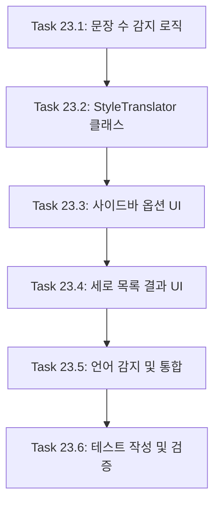

# FEATURE-023: 대화 상황별 번역 옵션

## 개요

- **기능명**: 대화 상황별 번역 옵션
- **상태**: 🔲 예정
- **분류**: 백엔드+프론트엔드
- **우선순위**: P2 (보통)
- **복잡도**: Complex (10h+)
- **분석 수준**: 완료
- **진행률**: 0%
- **예상 시간**: 12시간
- **실제 소요**: - (완료 후 기록)
- **시작일**: -
- **완료일**: -

## 기능 설명

한국어→영어 번역 시, 사용자가 **다양한 번역 스타일 중에서 선택**하거나 **짧은 대화 텍스트의 경우 AI가 자동으로 여러 스타일의 번역을 제공**하는 기능입니다. 사용자는 상황에 맞는 가장 적절한 번역을 선택할 수 있습니다.

### 목표

- 한국어→영어 번역에만 적용 (영어→한국어는 기존 방식 유지)
- 5가지 번역 스타일 제공: 자연스러운 구어체, 비즈니스 기본, 공식/문서용, 원문 유지, 간결하게
- 짧은 텍스트 (< 3문장): AI가 자동으로 2-3개 스타일 번역 생성
- 긴 텍스트 (≥ 3문장): 사용자가 원하는 스타일 선택 (단일 또는 다중)
- 번역 결과를 세로 목록으로 표시
- 추가 옵션: 고유명사 유지, 대안 표현 함께 보기, 커스텀 스타일 입력
- 번역 후에만 사이드바 옵션 활성화/비활성화

### 핵심 가치

- **선택의 자유**: 사용자가 상황에 맞는 번역 스타일 선택
- **효율성**: 짧은 대화는 AI가 자동으로 여러 스타일 제공
- **유연성**: 긴 텍스트는 필요한 스타일만 선택 가능
- **맞춤화**: 커스텀 스타일로 특수한 요구사항 반영

## 배경 및 필요성

### 현재 상황

- 모든 번역이 단일 스타일로 출력됨
- 대화의 상황과 맥락을 고려하지 않음
- 다른 스타일이 필요하면 다시 번역 요청해야 함
- 어떤 스타일이 적합한지 사용자가 판단하기 어려움

### 개선 효과

- 상황에 맞는 다양한 번역 스타일 즉시 확인
- 번역 재요청 없이 여러 스타일 비교 가능
- 짧은 대화는 AI가 자동으로 최적 스타일 추천
- 비즈니스, 친구, 공식 문서 등 다양한 상황에 대응

### 사용 시나리오

1. **짧은 메시지 번역**: "좋아요!" → AI가 자동으로 "Sounds good!", "That works.", "Perfect." 등 생성
2. **비즈니스 이메일**: 긴 텍스트 → 사용자가 "비즈니스 기본" + "공식/문서용" 선택하여 비교
3. **기술 문서 번역**: "원문 유지" 스타일로 정확한 번역
4. **SNS 메시지**: "자연스러운 구어체" + "간결하게" 선택하여 캐주얼하게 번역

## 요구사항 (FR + NFR)

### FR-1: 언어 방향 감지 및 제한

- 한국어→영어 번역만 이 기능 적용
- 영어→한국어 번역은 기존 방식 유지 (또는 FEATURE-021 사용)
- 자동 언어 감지로 한국어 입력 확인
- 사이드바 옵션은 번역 후 한국어→영어로 확인되면 활성화

### FR-2: 문장 수 자동 감지

- 입력 텍스트의 문장 수 계산
- 기준: 3문장 미만 = 짧은 텍스트, 3문장 이상 = 긴 텍스트
- 문장 구분: `.`, `!`, `?`, `。` 등으로 판단
- 사이드바에 감지 결과 표시 (옵션)

### FR-3: 5가지 번역 스타일 정의

번역 스타일별 프롬프트 지침:

| 스타일               | 설명                                    | 프롬프트 지침                                                                 |
| -------------------- | --------------------------------------- | ----------------------------------------------------------------------------- |
| 자연스러운 구어체    | 친구와 대화하는 듯한 자연스러운 영어    | Use natural, conversational English as if speaking with a friend.            |
| 비즈니스 기본        | 비즈니스 환경에 적합한 중립적 표현      | Use standard business English, professional but not overly formal.           |
| 공식/문서용          | 공식 문서, 보고서에 적합한 격식 있는 표현 | Use formal, official English suitable for documents and reports.             |
| 원문 유지            | 직역 중심, 원문 구조와 의미 최대한 보존 | Translate literally, preserving the original structure and meaning as much as possible. |
| 간결하게             | 핵심만 간결하게 전달                    | Translate concisely, conveying only the core message.                        |

### FR-4: 짧은 텍스트 자동 다중 스타일 생성

- 3문장 미만 입력 시 자동으로 2-3개 스타일로 번역 생성
- AI가 상황에 맞는 스타일 자동 선택 (예: 대화 → 구어체 + 간결하게)
- 사용자 개입 없이 자동 실행
- 결과는 세로 목록으로 표시

### FR-5: 긴 텍스트 사용자 선택 스타일 생성

- 3문장 이상 입력 시 기본적으로 단일 스타일 번역 (기존 방식)
- 사이드바에서 사용자가 원하는 스타일 선택 가능 (단일 또는 다중)
- 라디오 버튼 (단일 선택) 또는 체크박스 (다중 선택)
- 선택 후 번역 실행

### FR-6: 추가 옵션

- **고유명사 유지**: 인명, 지명, 브랜드명 등을 원문 그대로 유지
- **대안 표현 함께 보기**: 동일한 스타일 내에서 다른 표현 2-3개 제공
- **커스텀 스타일 입력**: 사용자가 직접 스타일 지침 입력 (텍스트 필드)

### FR-7: 번역 결과 세로 목록 UI

- 여러 스타일 번역 결과를 세로로 나열
- 각 결과는 다음 구성:
  - 스타일 제목 (예: "📋 비즈니스 기본")
  - 번역 텍스트
  - 복사 버튼 (각 결과마다 독립적)
- Markdown 포맷 보존
- 스크롤 가능한 레이아웃

### FR-8: 사이드바 옵션 활성화 타이밍

- **번역 전**: 사이드바 옵션 비활성화 (회색 처리)
- **번역 후**: 한국어→영어로 감지되면 옵션 활성화
- **영어→한국어**: 옵션 계속 비활성화 (이 기능 미적용)
- session_state로 활성화 상태 관리

### NFR-1: 성능

- 다중 스타일 생성 시 응답 시간 10초 이내
- 짧은 텍스트 자동 생성은 병렬 처리로 최적화
- 긴 텍스트 다중 선택 시에도 병렬 처리

### NFR-2: 비용 최적화

- 짧은 텍스트만 자동 다중 생성 (3문장 미만)
- 긴 텍스트는 사용자가 선택한 스타일만 생성
- 불필요한 번역 생성 방지
- 사용자에게 다중 스타일 생성 시 비용 증가 안내

### NFR-3: 확장성

- 향후 스타일 추가 가능한 구조
- 다른 언어 방향 지원 가능 (영어→한국어, 중국어 등)
- 커스텀 스타일 저장 기능 확장 가능

## 아키텍처 설계

### 컴포넌트 구조

```text
components/
├── translation.py              # 기존 TranslationManager (수정 최소화)
├── style_translator.py         # 새로 추가: 다중 스타일 번역 관리
└── ...

app.py                          # UI: 사이드바 옵션 + 세로 목록 결과 표시
utils.py                        # 문장 수 감지 함수 추가
```

### StyleTranslator 클래스 설계

```python
"""components/style_translator.py"""

import logging
from typing import List, Dict, Optional
from openai import OpenAI

logger = logging.getLogger("transbot.style_translator")


class StyleTranslator:
    """다양한 스타일로 번역을 생성하는 클래스"""

    # 스타일 상수 및 정의
    STYLE_CONVERSATIONAL = "conversational"     # 자연스러운 구어체
    STYLE_BUSINESS = "business"                 # 비즈니스 기본
    STYLE_FORMAL = "formal"                     # 공식/문서용
    STYLE_LITERAL = "literal"                   # 원문 유지
    STYLE_CONCISE = "concise"                   # 간결하게

    STYLE_LABELS = {
        STYLE_CONVERSATIONAL: "📱 자연스러운 구어체",
        STYLE_BUSINESS: "💼 비즈니스 기본",
        STYLE_FORMAL: "📋 공식/문서용",
        STYLE_LITERAL: "📝 원문 유지",
        STYLE_CONCISE: "✂️ 간결하게"
    }

    STYLE_INSTRUCTIONS = {
        STYLE_CONVERSATIONAL: "Use natural, conversational English as if speaking with a friend.",
        STYLE_BUSINESS: "Use standard business English, professional but not overly formal.",
        STYLE_FORMAL: "Use formal, official English suitable for documents and reports.",
        STYLE_LITERAL: "Translate literally, preserving the original structure and meaning as much as possible.",
        STYLE_CONCISE: "Translate concisely, conveying only the core message."
    }

    def __init__(
        self,
        client: OpenAI,
        model: str = "gpt-4o-mini",
        temperature: float = 0.3,
        max_tokens: int = 2000,
        timeout: int = 30
    ):
        """
        Args:
            client: OpenAI 클라이언트
            model: 사용할 AI 모델
            temperature: 생성 온도 (0-1)
            max_tokens: 최대 토큰 수
            timeout: 타임아웃 (초)
        """
        self.client = client
        self.model = model
        self.temperature = temperature
        self.max_tokens = max_tokens
        self.timeout = timeout

    def translate_single_style(
        self,
        text: str,
        style: str,
        source_lang: str = "Korean",
        target_lang: str = "English",
        preserve_proper_nouns: bool = False,
        custom_instruction: Optional[str] = None
    ) -> str:
        """단일 스타일로 번역

        Args:
            text: 번역할 텍스트
            style: 스타일 키 (STYLE_* 상수 중 하나)
            source_lang: 원본 언어
            target_lang: 대상 언어
            preserve_proper_nouns: 고유명사 유지 여부
            custom_instruction: 커스텀 스타일 지침 (있으면 style 무시)

        Returns:
            번역된 텍스트
        """
        try:
            # 스타일 지침 생성
            if custom_instruction:
                style_instruction = custom_instruction
            else:
                style_instruction = self.STYLE_INSTRUCTIONS.get(
                    style,
                    self.STYLE_INSTRUCTIONS[self.STYLE_BUSINESS]  # 기본값
                )

            # 고유명사 유지 옵션
            proper_noun_instruction = ""
            if preserve_proper_nouns:
                proper_noun_instruction = "\nIMPORTANT: Preserve all proper nouns (names, places, brands) in their original form."

            # 시스템 프롬프트 구성
            system_prompt = f"""You are a professional translator. Translate the following {source_lang} text to {target_lang}.
IMPORTANT: Preserve all Markdown formatting exactly as it appears in the original text.

STYLE INSTRUCTION: {style_instruction}{proper_noun_instruction}

Only respond with the translation, nothing else."""

            # API 호출
            response = self.client.chat.completions.create(
                model=self.model,
                messages=[
                    {"role": "system", "content": system_prompt},
                    {"role": "user", "content": text}
                ],
                temperature=self.temperature,
                max_tokens=self.max_tokens,
                timeout=self.timeout
            )

            translation = response.choices[0].message.content

            logger.info(
                "스타일 번역 완료",
                extra={
                    "style": style,
                    "input_length": len(text),
                    "output_length": len(translation)
                }
            )

            return translation

        except Exception as e:
            logger.error(
                f"{style} 스타일 번역 실패",
                extra={"error": str(e)},
                exc_info=True
            )
            raise

    def translate_multi_style(
        self,
        text: str,
        styles: List[str],
        source_lang: str = "Korean",
        target_lang: str = "English",
        preserve_proper_nouns: bool = False,
        include_alternatives: bool = False
    ) -> Dict[str, str]:
        """여러 스타일로 번역 생성

        Args:
            text: 번역할 텍스트
            styles: 스타일 키 리스트
            source_lang: 원본 언어
            target_lang: 대상 언어
            preserve_proper_nouns: 고유명사 유지 여부
            include_alternatives: 대안 표현 포함 여부 (각 스타일당 2-3개)

        Returns:
            {
                "conversational": "번역 결과 1",
                "business": "번역 결과 2",
                ...
            }
        """
        results = {}

        logger.info(
            "다중 스타일 번역 시작",
            extra={
                "styles": styles,
                "include_alternatives": include_alternatives
            }
        )

        for style in styles:
            try:
                translation = self.translate_single_style(
                    text=text,
                    style=style,
                    source_lang=source_lang,
                    target_lang=target_lang,
                    preserve_proper_nouns=preserve_proper_nouns
                )

                # 대안 표현 생성 (옵션)
                if include_alternatives:
                    alternatives = self._generate_alternatives(
                        text=text,
                        base_translation=translation,
                        style=style,
                        source_lang=source_lang,
                        target_lang=target_lang
                    )
                    results[style] = {
                        "primary": translation,
                        "alternatives": alternatives
                    }
                else:
                    results[style] = translation

            except Exception as e:
                logger.error(
                    f"{style} 스타일 번역 실패, 건너뜀",
                    extra={"error": str(e)}
                )
                results[style] = f"[{style} 번역 실패]"

        return results

    def auto_select_styles_for_short_text(self, text: str) -> List[str]:
        """짧은 텍스트에 적합한 스타일 자동 선택

        Args:
            text: 분석할 텍스트

        Returns:
            추천 스타일 리스트 (2-3개)
        """
        # 간단한 휴리스틱: 대화체는 구어체 + 간결하게 추천
        # 향후 AI 기반 분석으로 개선 가능

        # 기본 추천
        recommended = [
            self.STYLE_CONVERSATIONAL,
            self.STYLE_CONCISE
        ]

        # 비즈니스 키워드 감지 시 비즈니스 스타일 추가
        business_keywords = ["회의", "보고", "프로젝트", "일정", "업무"]
        if any(keyword in text for keyword in business_keywords):
            recommended.append(self.STYLE_BUSINESS)
        else:
            # 일반 대화는 구어체 + 간결하게만
            pass

        logger.info(
            "자동 스타일 선택 완료",
            extra={"recommended_styles": recommended}
        )

        return recommended

    def _generate_alternatives(
        self,
        text: str,
        base_translation: str,
        style: str,
        source_lang: str,
        target_lang: str
    ) -> List[str]:
        """동일 스타일 내에서 대안 표현 생성

        Args:
            text: 원본 텍스트
            base_translation: 기본 번역
            style: 스타일
            source_lang: 원본 언어
            target_lang: 대상 언어

        Returns:
            대안 표현 리스트 (2-3개)
        """
        try:
            style_instruction = self.STYLE_INSTRUCTIONS.get(style, "")

            prompt = f"""Given this translation:
"{base_translation}"

Provide 2-3 alternative ways to express the same meaning in {target_lang}, following this style: {style_instruction}

Only output the alternatives, one per line, without numbering or explanation."""

            response = self.client.chat.completions.create(
                model=self.model,
                messages=[
                    {"role": "system", "content": "You are a professional translator providing alternative expressions."},
                    {"role": "user", "content": prompt}
                ],
                temperature=0.7,  # 다양성을 위해 높은 온도
                max_tokens=500,
                timeout=self.timeout
            )

            alternatives_text = response.choices[0].message.content
            alternatives = [line.strip() for line in alternatives_text.split('\n') if line.strip()]

            logger.info(
                "대안 표현 생성 완료",
                extra={"style": style, "count": len(alternatives)}
            )

            return alternatives[:3]  # 최대 3개

        except Exception as e:
            logger.error(
                "대안 표현 생성 실패",
                extra={"error": str(e)}
            )
            return []
```

### utils.py에 추가할 함수

```python
def count_sentences(text: str) -> int:
    """텍스트의 문장 수 계산

    Args:
        text: 분석할 텍스트

    Returns:
        문장 수
    """
    import re

    # 문장 종결 부호로 분리
    sentences = re.split(r'[.!?。]+', text)

    # 빈 문자열 제거
    sentences = [s.strip() for s in sentences if s.strip()]

    return len(sentences)


def is_short_text(text: str, threshold: int = 3) -> bool:
    """텍스트가 짧은지 판단 (문장 수 기준)

    Args:
        text: 분석할 텍스트
        threshold: 짧은 텍스트 기준 (기본: 3문장)

    Returns:
        True if 짧은 텍스트, False otherwise
    """
    return count_sentences(text) < threshold
```

### 데이터 흐름

```text
1. 사용자 텍스트 입력
   ↓
2. 언어 감지 (LanguageDetector)
   ↓
3. 한국어→영어인가?
   ↓ YES
4. 문장 수 계산 (utils.count_sentences)
   ↓
5. 짧은 텍스트 (< 3문장)?
   ↓ YES                              ↓ NO
6a. AI 자동 스타일 선택 (2-3개)      6b. 기본 번역 수행 (단일 스타일)
   ↓                                  ↓
7a. 다중 스타일 번역 생성             7b. 번역 완료
   (StyleTranslator.translate_multi)
   ↓                                  ↓
8. 번역 완료 → 사이드바 옵션 활성화
   ↓
9. 사용자가 추가 스타일 선택 가능 (긴 텍스트의 경우)
   ↓
10. 결과를 세로 목록으로 표시
    - 각 스타일별 제목 + 번역 + 복사 버튼
```

## 작업(Task) 분해

### Task 23.1: 문장 수 감지 로직 구현 (백엔드)

**설명**: 텍스트의 문장 수를 계산하고 짧은 텍스트 여부를 판단하는 유틸리티 함수 구현

**세부 작업**:

1. `utils.py`에 `count_sentences()` 함수 추가
   - 정규식으로 문장 종결 부호 감지 (`.`, `!`, `?`, `。`)
   - 빈 문자열 제거 후 카운트
2. `utils.py`에 `is_short_text()` 함수 추가
   - threshold 파라미터 (기본값: 3)
   - count_sentences() 호출하여 판단
3. 다양한 텍스트 케이스 테스트
   - 단문 (1-2문장)
   - 중문 (3-5문장)
   - 장문 (10+ 문장)
   - 문장 부호 없는 텍스트
4. 로깅 추가

**예상 시간**: 1.5시간

**의존성**: 없음

**테스트 범위**:

- 다양한 문장 수 텍스트 테스트
- 엣지 케이스 (빈 텍스트, 문장 부호 없음)
- 한국어/영어 모두 테스트

**완료 조건**:

- [ ] count_sentences() 함수 구현 완료
- [ ] is_short_text() 함수 구현 완료
- [ ] 단위 테스트 8개 이상 작성 및 통과
- [ ] 다양한 텍스트 케이스 검증

### Task 23.2: StyleTranslator 클래스 구현 (백엔드)

**설명**: 여러 스타일로 번역을 생성하고 관리하는 클래스 구현

**세부 작업**:

1. `components/style_translator.py` 파일 생성
2. `StyleTranslator` 클래스 구현
   - 5개 스타일 상수 정의 (STYLE_CONVERSATIONAL 등)
   - STYLE_LABELS 딕셔너리 (이모지 포함)
   - STYLE_INSTRUCTIONS 딕셔너리 (영어 프롬프트)
3. `translate_single_style()` 메서드
   - 단일 스타일 번역 실행
   - 고유명사 유지 옵션 지원
   - 커스텀 지침 지원
4. `translate_multi_style()` 메서드
   - 여러 스타일 번역 생성 (순차 또는 병렬)
   - 대안 표현 생성 옵션 (include_alternatives)
   - 일부 실패 시에도 다른 결과 반환
5. `auto_select_styles_for_short_text()` 메서드
   - 짧은 텍스트에 적합한 2-3개 스타일 자동 선택
   - 비즈니스 키워드 감지 휴리스틱
6. `_generate_alternatives()` 메서드
   - 동일 스타일 내 대안 표현 2-3개 생성
7. 에러 핸들링 및 로깅
8. Langfuse 추적 통합 (옵션)

**예상 시간**: 4시간

**의존성**: 없음

**테스트 범위**:

- 각 스타일별 번역 결과 검증
- 다중 스타일 동시 생성 테스트
- 고유명사 유지 옵션 테스트
- 대안 표현 생성 테스트
- 에러 핸들링 (일부 스타일 실패)

**완료 조건**:

- [ ] StyleTranslator 클래스 구현 완료
- [ ] 5개 스타일 모두 동작 확인
- [ ] 다중 스타일 생성 동작 확인
- [ ] 단위 테스트 15개 이상 작성 및 통과
- [ ] 통합 테스트 5개 이상 작성 및 통과

### Task 23.3: 사이드바 스타일 옵션 UI 구현 (프론트엔드)

**설명**: 사이드바에 스타일 선택 옵션 및 추가 옵션 UI 구현

**세부 작업**:

1. `app.py` 수정
2. 사이드바에 스타일 선택 섹션 추가
   - 제목: "🎨 번역 스타일 옵션" (한국어→영어만 활성화)
   - 활성화 조건: 번역 완료 + 한국어→영어 감지
   - 비활성화 시 회색 처리 + 안내 메시지
3. 짧은 텍스트 vs 긴 텍스트 UI 분기
   - 짧은 텍스트: "AI가 자동으로 여러 스타일 생성" 안내
   - 긴 텍스트: 스타일 선택 UI 표시
4. 긴 텍스트용 스타일 선택 UI
   - 체크박스로 다중 선택 가능
   - 5개 스타일 (이모지 + 레이블)
   - 기본 선택: "비즈니스 기본"
5. 추가 옵션 UI
   - 체크박스: "고유명사 유지"
   - 체크박스: "대안 표현 함께 보기"
   - 텍스트 입력: "커스텀 스타일 지침"
6. session_state로 상태 관리
   - 번역 완료 여부
   - 언어 방향 (한국어→영어 여부)
   - 선택된 스타일들
   - 추가 옵션 값들

**예상 시간**: 2.5시간

**의존성**: Task 23.1, 23.2

**테스트 범위**:

- 번역 전 비활성화 확인
- 번역 후 활성화 확인 (한국어→영어만)
- 영어→한국어 시 비활성화 유지
- 스타일 선택 동작 확인
- 추가 옵션 입력 확인

**완료 조건**:

- [ ] 사이드바 스타일 섹션 구현 완료
- [ ] 활성화/비활성화 로직 동작 확인
- [ ] 짧은/긴 텍스트 UI 분기 확인
- [ ] 추가 옵션 UI 구현 완료
- [ ] 수동 UI 테스트 완료

### Task 23.4: 번역 결과 세로 목록 UI 구현 (프론트엔드)

**설명**: 여러 스타일의 번역 결과를 세로 목록으로 표시하는 UI 구현

**세부 작업**:

1. `app.py` 수정
2. 다중 스타일 결과 표시 함수 추가
   - 각 스타일별로 세로로 나열
   - 구조: 스타일 제목 (이모지 + 레이블) → 번역 텍스트 → 복사 버튼
3. 스타일 제목 표시
   - st.subheader() 또는 st.markdown()으로 표시
   - 예: "📱 자연스러운 구어체"
4. 번역 텍스트 표시
   - st.text_area() 또는 st.markdown()
   - Markdown 포맷 보존
   - 읽기 전용
5. 각 결과마다 독립적인 복사 버튼
   - 클릭 시 해당 스타일 번역만 복사
6. 대안 표현 표시 (옵션 활성화 시)
   - expander 또는 별도 섹션으로 표시
   - "대안 표현" 제목 + 리스트
7. 반응형 레이아웃
   - 스크롤 가능한 영역
   - 모바일 대응

**예상 시간**: 2.5시간

**의존성**: Task 23.3

**테스트 범위**:

- 단일 스타일 결과 표시
- 다중 스타일 결과 표시
- 복사 버튼 동작 확인
- 대안 표현 표시 확인
- Markdown 포맷 보존 확인

**완료 조건**:

- [ ] 세로 목록 UI 구현 완료
- [ ] 각 스타일별 제목 + 텍스트 + 복사 버튼 확인
- [ ] 대안 표현 UI 구현 완료
- [ ] 반응형 레이아웃 동작 확인
- [ ] 수동 UI 테스트 완료 (데스크톱 + 모바일)

### Task 23.5: 한국어→영어 감지 및 통합 (통합)

**설명**: 언어 방향 감지 및 전체 번역 플로우 통합

**세부 작업**:

1. `app.py`의 main() 흐름 수정
2. 번역 전 언어 감지 (LanguageDetector 활용)
3. 한국어→영어 여부 판단
   - 한국어 입력 감지
   - 번역 방향 확인
4. session_state에 언어 방향 저장
5. 번역 완료 후 사이드바 활성화 로직
   - 한국어→영어: 옵션 활성화
   - 영어→한국어: 옵션 비활성화
6. 짧은 텍스트 자동 처리 플로우
   - 문장 수 계산 (is_short_text())
   - 자동 스타일 선택 (auto_select_styles_for_short_text())
   - 다중 스타일 번역 실행 (translate_multi_style())
7. 긴 텍스트 수동 처리 플로우
   - 기본 단일 스타일 번역 (기존 방식)
   - 사용자가 추가 스타일 선택 시 재번역
8. 결과 표시 플로우 통합
   - 단일 결과: 기존 UI
   - 다중 결과: 새로운 세로 목록 UI
9. 에러 핸들링 전체 통합

**예상 시간**: 2시간

**의존성**: Task 23.1, 23.2, 23.3, 23.4

**테스트 범위**:

- 한국어→영어 감지 확인
- 영어→한국어 감지 확인
- 짧은 텍스트 자동 플로우 확인
- 긴 텍스트 수동 플로우 확인
- 전체 UI 통합 확인

**완료 조건**:

- [ ] 언어 방향 감지 로직 구현 완료
- [ ] 짧은/긴 텍스트 플로우 분기 동작 확인
- [ ] 사이드바 활성화 타이밍 정확히 동작
- [ ] 전체 번역 플로우 통합 완료
- [ ] 수동 통합 테스트 완료

### Task 23.6: 테스트 작성 및 검증 (테스트)

**설명**: 전체 기능에 대한 단위 테스트 및 통합 테스트 작성

**세부 작업**:

1. `tests/test_style_translator.py` 생성 (15개 테스트)
   - 각 스타일별 번역 테스트 (5개)
   - 다중 스타일 생성 테스트
   - 고유명사 유지 테스트
   - 대안 표현 생성 테스트
   - 자동 스타일 선택 테스트
   - 에러 핸들링 테스트
2. `tests/test_utils.py` 업데이트 (8개 추가)
   - count_sentences() 테스트
   - is_short_text() 테스트
   - 다양한 문장 구조 테스트
3. 통합 테스트 (5개)
   - 전체 플로우 (입력 → 감지 → 번역 → 결과)
   - 짧은 텍스트 플로우
   - 긴 텍스트 플로우
4. 코드 커버리지 확인 (80% 이상)
5. 실제 대화 텍스트로 수동 테스트

**예상 시간**: 2시간

**의존성**: Task 23.1, 23.2, 23.3, 23.4, 23.5

**테스트 범위**:

- 모든 스타일에 대한 번역 품질 테스트
- 언어 방향 감지 정확도 테스트
- UI 통합 테스트
- 성능 테스트 (응답 시간)

**완료 조건**:

- [ ] 단위 테스트 총 28개 이상 작성
- [ ] 통합 테스트 5개 작성
- [ ] 모든 테스트 통과
- [ ] 코드 커버리지 80% 이상
- [ ] 수동 테스트 완료 (10개 이상 실제 대화 샘플)

## 작업 순서 및 의존성



**순차적 의존성**: 모든 Task는 순차적으로 진행 (병렬 작업 불가)

## 진행 현황

| Task      | 상태    | 진행률 | 시작일 | 완료일 | 비고 |
| --------- | ------- | ------ | ------ | ------ | ---- |
| Task 23.1 | 🔲 대기 | 0%     | -      | -      | -    |
| Task 23.2 | 🔲 대기 | 0%     | -      | -      | -    |
| Task 23.3 | 🔲 대기 | 0%     | -      | -      | -    |
| Task 23.4 | 🔲 대기 | 0%     | -      | -      | -    |
| Task 23.5 | 🔲 대기 | 0%     | -      | -      | -    |
| Task 23.6 | 🔲 대기 | 0%     | -      | -      | -    |

## 완료 기준

- [ ] StyleTranslator 클래스 구현 및 테스트 완료
- [ ] 5가지 스타일 모두 정상 동작
- [ ] 짧은 텍스트 자동 다중 스타일 생성 동작
- [ ] 긴 텍스트 사용자 선택 기반 생성 동작
- [ ] 한국어→영어만 적용, 영어→한국어는 비활성화
- [ ] 번역 후 사이드바 옵션 활성화 동작
- [ ] 세로 목록 UI로 결과 표시
- [ ] 추가 옵션 (고유명사, 대안 표현, 커스텀) 동작
- [ ] 단위 테스트 28개 이상, 통합 테스트 5개 이상 작성 및 통과
- [ ] 코드 커버리지 80% 이상 유지
- [ ] 기존 번역 기능 영향 없음 (회귀 테스트 통과)
- [ ] 응답 시간 10초 이내 (성능 기준 충족)
- [ ] 수동 테스트로 번역 품질 검증 (10개 이상 실제 대화 샘플)

## 테스트 계획

### 테스트 케이스

| ID    | 시나리오                                   | 예상 결과                                              |
| ----- | ------------------------------------------ | ------------------------------------------------------ |
| TC-1  | 짧은 한국어 메시지 (1문장) 입력           | AI 자동으로 2-3개 스타일 번역 생성                     |
| TC-2  | 긴 한국어 텍스트 (5문장) 입력             | 단일 스타일 번역 생성, 사이드바 옵션 활성화            |
| TC-3  | 영어→한국어 번역                           | 사이드바 옵션 비활성화 유지                            |
| TC-4  | "자연스러운 구어체" 스타일 선택            | 구어체 표현 사용                                       |
| TC-5  | "공식/문서용" 스타일 선택                  | 격식 있는 영어 표현 사용                               |
| TC-6  | "원문 유지" 스타일 선택                    | 직역 중심, 원문 구조 보존                              |
| TC-7  | 고유명사 유지 옵션 활성화                  | 인명/지명 원문 그대로 유지                             |
| TC-8  | 대안 표현 옵션 활성화                      | 각 스타일당 2-3개 대안 표시                            |
| TC-9  | 커스텀 스타일 지침 입력                    | 커스텀 지침 적용된 번역 생성                           |
| TC-10 | 다중 스타일 선택 (비즈니스 + 공식)        | 두 스타일 모두 번역 생성, 세로로 표시                  |
| TC-11 | 복사 버튼 클릭                             | 해당 스타일 번역만 클립보드에 복사                     |
| TC-12 | Markdown 포맷 포함 텍스트                  | 모든 스타일에서 포맷 보존                              |
| TC-13 | 문장 수 감지 경계값 (정확히 3문장)        | 긴 텍스트로 처리                                       |
| TC-14 | 번역 전 사이드바 옵션 상태                 | 비활성화 (회색 처리)                                   |
| TC-15 | 번역 후 사이드바 옵션 상태 (한국어→영어) | 활성화                                                 |
| TC-16 | 일부 스타일 번역 실패                      | 성공한 스타일만 표시, 실패 메시지                      |
| TC-17 | 매우 짧은 텍스트 ("안녕!")                 | 자동으로 구어체 + 간결하게 스타일 생성                 |
| TC-18 | 비즈니스 키워드 포함 짧은 텍스트           | 자동으로 비즈니스 + 구어체 + 간결하게 스타일 생성     |
| TC-19 | 긴 텍스트에서 스타일 변경 후 재번역        | 선택한 스타일로 재번역, 이전 결과는 유지 또는 대체    |
| TC-20 | 성능 테스트: 다중 스타일 (3개) 생성 시간  | 10초 이내 완료                                         |

### 단위 테스트 구조

```python
# tests/test_style_translator.py

def test_translate_conversational_style():
    """자연스러운 구어체 번역 테스트"""
    pass

def test_translate_business_style():
    """비즈니스 기본 번역 테스트"""
    pass

def test_translate_formal_style():
    """공식/문서용 번역 테스트"""
    pass

def test_translate_literal_style():
    """원문 유지 번역 테스트"""
    pass

def test_translate_concise_style():
    """간결하게 번역 테스트"""
    pass

def test_translate_multi_style():
    """다중 스타일 동시 번역 테스트"""
    pass

def test_preserve_proper_nouns():
    """고유명사 유지 옵션 테스트"""
    pass

def test_generate_alternatives():
    """대안 표현 생성 테스트"""
    pass

def test_auto_select_styles_short_text():
    """짧은 텍스트 자동 스타일 선택 테스트"""
    pass

def test_auto_select_styles_business_keywords():
    """비즈니스 키워드 감지 테스트"""
    pass

def test_custom_instruction():
    """커스텀 스타일 지침 테스트"""
    pass

def test_partial_failure_handling():
    """일부 스타일 실패 시 처리 테스트"""
    pass

def test_markdown_preservation():
    """Markdown 포맷 보존 테스트"""
    pass

def test_performance_multi_style():
    """다중 스타일 생성 성능 테스트"""
    pass


# tests/test_utils.py (추가)

def test_count_sentences_single():
    """단일 문장 카운트 테스트"""
    pass

def test_count_sentences_multiple():
    """다중 문장 카운트 테스트"""
    pass

def test_count_sentences_no_punctuation():
    """문장 부호 없는 텍스트 테스트"""
    pass

def test_count_sentences_korean():
    """한국어 문장 카운트 테스트"""
    pass

def test_is_short_text_true():
    """짧은 텍스트 판단 (True) 테스트"""
    pass

def test_is_short_text_false():
    """긴 텍스트 판단 (False) 테스트"""
    pass

def test_is_short_text_boundary():
    """경계값 (정확히 3문장) 테스트"""
    pass

def test_is_short_text_custom_threshold():
    """커스텀 threshold 테스트"""
    pass
```

## 리스크 및 대응 방안

| 리스크                                 | 확률 | 영향 | 대응 방안                                                                      |
| -------------------------------------- | ---- | ---- | ------------------------------------------------------------------------------ |
| 다중 스타일 생성 시 응답 시간 증가     | 높음 | 중   | 병렬 처리 구현, 짧은 텍스트만 자동 생성, 긴 텍스트는 사용자 선택 기반         |
| 번역 품질 저하 (스타일 강조로 인한)    | 중   | 높음 | 기존 프롬프트 구조 유지, 스타일 지침은 추가만, A/B 테스트                      |
| 비용 증가 (다중 번역)                  | 높음 | 중   | 짧은 텍스트만 자동 생성, 긴 텍스트는 사용자 선택 기반, 비용 안내 메시지       |
| UI 복잡도 증가                         | 중   | 낮음 | 직관적인 세로 목록 UI, 명확한 레이블, 도움말 제공                              |
| 한국어→영어만 적용하는 제약            | 낮음 | 낮음 | 명확한 안내 메시지, 영어→한국어는 FEATURE-021 활용                             |
| 짧은/긴 텍스트 분류 기준 (3문장) 적절성 | 중   | 낮음 | 실제 사용 데이터 수집 후 조정 가능하도록 설계, threshold를 설정 파일로 분리   |
| 커스텀 스타일 악용 (부적절한 지침)     | 낮음 | 낮음 | 입력 검증, 프롬프트 인젝션 방지, 길이 제한 (1000자)                            |

## 비용 최적화 전략

1. **짧은 텍스트만 자동 다중 생성**
   - 3문장 미만: 자동으로 2-3개 스타일 생성
   - 3문장 이상: 사용자가 선택한 스타일만 생성

2. **병렬 처리로 응답 시간 단축**
   - 다중 스타일 생성 시 병렬 API 호출
   - 체감 대기 시간 감소

3. **사용자 안내**
   - "다중 스타일 선택 시 비용이 증가할 수 있습니다" 안내 메시지
   - 선택한 스타일 개수 표시

4. **캐싱 (향후 고려)**
   - 동일한 텍스트 + 스타일 조합은 캐싱하여 재사용
   - Redis 또는 in-memory 캐싱

## 참고 자료

- [OpenAI Chat Completions API](https://platform.openai.com/docs/api-reference/chat)
- [Streamlit Sidebar](https://docs.streamlit.io/library/api-reference/layout/st.sidebar)
- [Streamlit Checkbox](https://docs.streamlit.io/library/api-reference/widgets/st.checkbox)
- [Python 정규식 (re 모듈)](https://docs.python.org/3/library/re.html)
- [FEATURE-021: 번역 품질 및 스타일 설정](./FEATURE-021.md) (관련 기능 - 영어→한국어)

---

**작성일**: 2026-02-06
**작성자**: Claude Sonnet 4.5
